# Cited-chart review: AI description -> chart -> frozen detector

Each block is a Stage A chart the AI rated ACTIONABLE_NOW and cited for the setup. Detector readings are for the window ending at the chart's last candle. Nothing was changed.

## S1 bullish_breakout_from_right_edge_consolidation: 12 cited charts, recognized (present at T or fired on the last two candles): 0

Charts failing each condition: {"A2 compact right edge ZR <= q33": 11, "A3 close near the top DT <= q33": 5, "A1 recent swing high and up-leg > q33": 3}
Charts missing by exactly one condition: {"A2 compact right edge ZR <= q33": 4, "A1 recent swing high and up-leg > q33": 1}

### S0013 (2025-11-23T01:30:00+00:00) - present at T: False, present at T-1: False, fired on last two: False
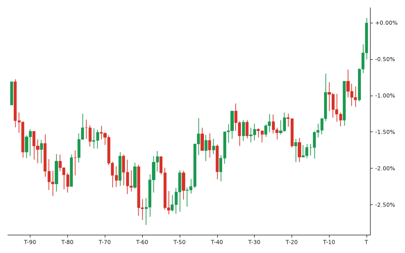

AI summary: Price spent most of the chart in a choppy decline and sideways-to-down range, then turned up with a sequence of higher candles into the right edge. At the far right, price has broken above the prior short-term swing highs and is pressing into the top of the visible range near the 0.00% area.
AI context: Before the current move, price was oscillating in a broad range after the earlier selloff, with repeated lower swings and rebounds. The immediate context before the right-edge move is a consolidation around the -1.5% to -1.0% area.
AI location: The current rally has pushed through the recent cluster of highs around the -1.0% to -0.8% region and is now at the highest visible point on the chart, near the prior ceiling at 0.00%.
AI development: After the dip around T-20, price formed a small base, then printed a series of higher highs and higher lows. The last several candles accelerated upward, with successive green bodies breaking above the previous local peaks.
AI trigger: A completed candle closing above the prior visible swing high near the 0.00% level, with the breakout already printed on the last candle.

| condition | ok | detail |
|---|---|---|
| A1 recent swing high and up-leg > q33 | ok | swing high idx 84 (recent from 48), UP 0.4119 vs q33 0.1889 |
| A2 compact right edge ZR <= q33 | NO | ZR 0.6972 vs q33 0.3754 |
| A3 close near the top DT <= q33 | ok | DT 0.0226 vs q33 0.0890 (level 85892.50) |

### S0036 (2026-05-26T14:00:00+00:00) - present at T: False, present at T-1: False, fired on last two: False
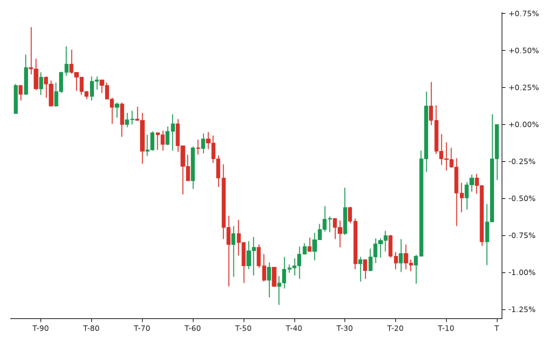

AI summary: Price trended down from the left side into a deep low, then rallied sharply near the right edge, followed by a pullback and another strong rebound into the last candle. The right edge shows price pressing back up toward the zero line after a recent drop.
AI context: After a prolonged decline and a basing/recovery attempt from the mid-chart lows, price made a sharp impulsive rise and then retraced.
AI location: The current candles are testing the upper end of the recent rebound area after a steep move up from the local low, with the last candle reclaiming the prior pullback zone and reaching near the 0.00 level.
AI development: A strong green impulse lifted price from the recent low, then several red candles pulled it back lower, followed by a new green candle pushing up through the pullback highs.
AI trigger: A completed candle closes above the prior pullback high / local resistance of the most recent retracement after the sharp rebound.

| condition | ok | detail |
|---|---|---|
| A1 recent swing high and up-leg > q33 | ok | swing high idx 82 (recent from 48), UP 0.7265 vs q33 0.1889 |
| A2 compact right edge ZR <= q33 | NO | ZR 0.7265 vs q33 0.3754 |
| A3 close near the top DT <= q33 | NO | DT 0.1534 vs q33 0.0890 (level 77600.00) |

### S0120 (2026-05-01T05:30:00+00:00) - present at T: False, present at T-1: False, fired on last two: False
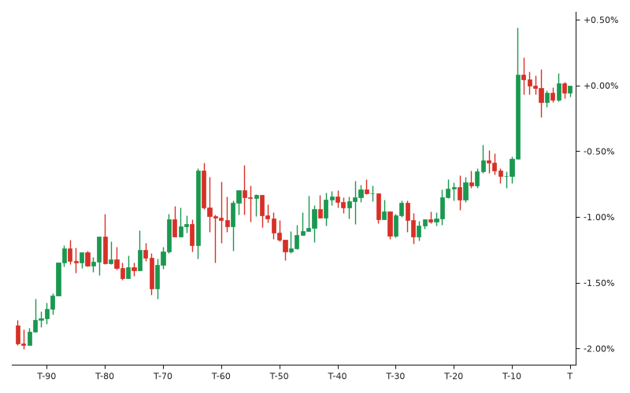

AI summary: Price trended up from the far left, then spent a long middle section chopping sideways-to-up in a series of swings. Near the right edge it broke sharply higher in one tall green candle, then paused just under the spike high with small candles near flat.
AI context: Before the right-edge move, price had been recovering from a deeper low and then consolidating in a rising, choppy range below the recent high.
AI location: The current area is interesting because price has pushed above the prior swing highs and is now holding near the top of the breakout candle, just below the spike high at the right edge.
AI development: A sequence of higher lows and small range candles led into a strong impulsive upside candle that broke the recent consolidation ceiling. After that spike, the next candles pulled back slightly and compressed near the breakout area.
AI trigger: A completed candle that closes above the tall spike high would confirm continuation from the breakout.

| condition | ok | detail |
|---|---|---|
| A1 recent swing high and up-leg > q33 | ok | swing high idx 86 (recent from 48), UP 0.4976 vs q33 0.1889 |
| A2 compact right edge ZR <= q33 | NO | ZR 0.6167 vs q33 0.3754 |
| A3 close near the top DT <= q33 | NO | DT 0.1794 vs q33 0.0890 (level 77421.20) |

### S0159 (2025-12-31T01:30:00+00:00) - present at T: False, present at T-1: False, fired on last two: False
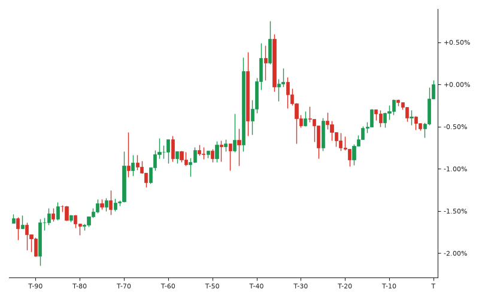

AI summary: Price trended up from the left, peaked sharply around the middle, then sold off and chopped lower before recovering into the right edge. At the far right, a strong green candle has pushed back up to around the 0% area after a short base.
AI context: After the mid-chart spike and decline, price spent the right-half of the chart oscillating in a lower range and then turned back up from around the -0.5% to -0.8% area.
AI location: The current candle is testing and slightly exceeding the local swing high / near-flat resistance around the 0% line at the right edge.
AI development: A small rebound formed after the prior downswing, several candles held near the lower-mid range, then the last few candles climbed steadily into a breakout attempt and the latest candle closed near the highs.
AI trigger: A completed candle closes above the immediate prior swing high / resistance near 0% with a clear bullish body.

| condition | ok | detail |
|---|---|---|
| A1 recent swing high and up-leg > q33 | NO | swing high idx 86 (recent from 48), UP 0.1141 vs q33 0.1889 |
| A2 compact right edge ZR <= q33 | ok | ZR 0.3514 vs q33 0.3754 |
| A3 close near the top DT <= q33 | ok | DT 0.0172 vs q33 0.0890 (level 88735.00) |

### S0163 (2026-01-09T15:30:00+00:00) - present at T: False, present at T-1: False, fired on last two: False
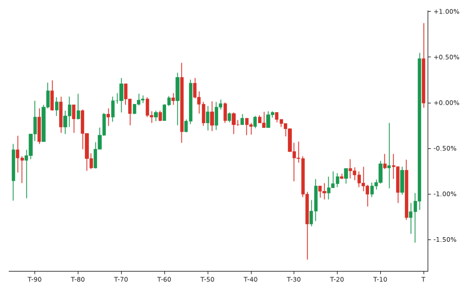

AI summary: Price drifted sideways-to-lower for most of the chart, then sold off sharply into the right side before a very large vertical green candle exploded upward at the edge. The last candle is near the top of its range, after a fast rebound from the recent low.
AI context: Before the right-edge move, price was chopping lower in a downward-sloping range and then made a sharp drop to a fresh local low near the -1.5% area.
AI location: The current bar has broken sharply up out of the recent lower consolidation and has pushed through the prior local swing area near the -0.5% to 0.0% region visible on the right half of the chart.
AI development: A sustained decline led into a steep flush down around T-30, then price base-built and drifted slightly upward/lower for several candles near the lows before one large bullish candle surged vertically at the right edge.
AI trigger: A completed candle that closes decisively above the recent consolidation/swing area, which is already shown by the final candle closing near the highs after the surge.

| condition | ok | detail |
|---|---|---|
| A1 recent swing high and up-leg > q33 | ok | swing high idx 87 (recent from 48), UP 0.3523 vs q33 0.1889 |
| A2 compact right edge ZR <= q33 | NO | ZR 0.9293 vs q33 0.3754 |
| A3 close near the top DT <= q33 | NO | DT 0.3378 vs q33 0.0890 (level 91999.00) |

### S0176 (2025-11-02T23:00:00+00:00) - present at T: False, present at T-1: False, fired on last two: False
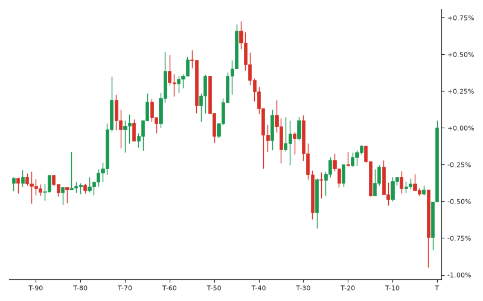

AI summary: Price rose strongly into a peak near the middle-left, then sold off in a choppy decline back toward the lower part of the range. At the right edge there is a very sharp bullish candle rebounding from a deep low near the bottom of the chart.
AI context: Before the current candle, price had been drifting lower after the prior down leg and was testing the lower area of the recent range.
AI location: The current candle is a large green breakout/reversal candle from around the -0.75% to -1.00% area back toward the 0.00% line, after several small candles near the lows.
AI development: A sequence of lower, choppy candles pressed into the low zone, then a deep selloff spike printed and was immediately followed by a strong full-bodied green candle.
AI trigger: The trigger has already occurred on the last completed candle: a strong bullish reversal candle that closes back above the prior low cluster and near/above the 0.00% line.

| condition | ok | detail |
|---|---|---|
| A1 recent swing high and up-leg > q33 | NO | swing high idx 87 (recent from 48), UP 0.1388 vs q33 0.1889 |
| A2 compact right edge ZR <= q33 | NO | ZR 0.5967 vs q33 0.3754 |
| A3 close near the top DT <= q33 | ok | DT 0.0302 vs q33 0.0890 (level 110471.10) |

### S0181 (2025-09-28T15:30:00+00:00) - present at T: False, present at T-1: False, fired on last two: False
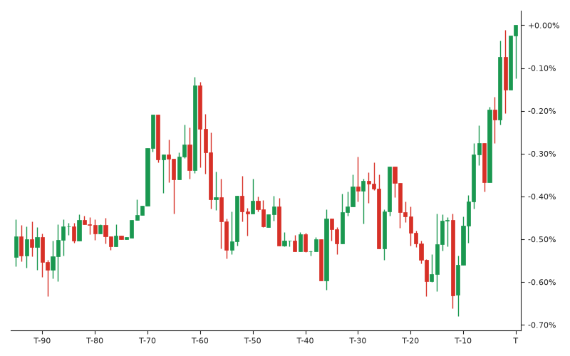

AI summary: Price spent most of the chart in a choppy range below zero, with multiple swings between roughly -0.60% and -0.30%. At the far right it has surged sharply upward in a strong sequence of mostly green candles to retest and reach around 0.00%.
AI context: Before the last leg, price was oscillating in a sideways-to-volatile range, then made a deep dip near the -0.60% area and reversed upward.
AI location: The current move is pressing into the prior highs/zero line at the right edge after a strong vertical advance from the recent low, with the latest candles clustered near the chart’s top boundary around +0.00%.
AI development: A low was made near the -0.60% region, followed by a sharp rebound, then a series of higher highs and higher lows accelerated into a near-vertical push. The last completed candles are testing the top of the visible range near 0.00%.
AI trigger: A completed candle closes at or above the prior swing high / around the 0.00% level after the strong advance.

| condition | ok | detail |
|---|---|---|
| A1 recent swing high and up-leg > q33 | ok | swing high idx 72 (recent from 48), UP 0.3222 vs q33 0.1889 |
| A2 compact right edge ZR <= q33 | NO | ZR 1.0000 vs q33 0.3754 |
| A3 close near the top DT <= q33 | ok | DT 0.0000 vs q33 0.0890 (level 109883.00) |

### S0201 (2026-04-29T10:15:00+00:00) - present at T: False, present at T-1: False, fired on last two: False
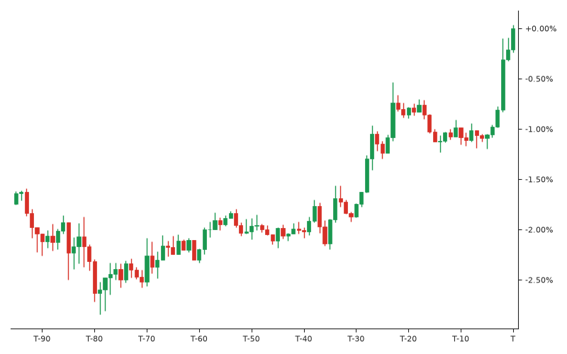

AI summary: Price fell early on the left, then spent a long stretch basing and slowly rising in overlapping candles. Near the right edge it broke sharply upward from the prior sideways range and is now pressing into fresh highs at the top of the chart.
AI context: Before the current move, price had already recovered from the earlier low and was chopping in a narrow range around the -1.1% to -1.0% area.
AI location: The interesting relationship is the strong bullish breakout from the recent consolidation, with the last candles extending above the prior swing highs and closing near the chart high around 0.00%.
AI development: A sideways-to-slightly-down cluster formed after the mid-chart rise, then price compressed near the upper end of that range, followed by two strong green candles that expanded upward and took out the nearby highs.
AI trigger: A completed candle that closes clearly above the prior consolidation high and above the immediate swing high from the last sideways range.

| condition | ok | detail |
|---|---|---|
| A1 recent swing high and up-leg > q33 | NO | swing high idx 84 (recent from 48), UP 0.1126 vs q33 0.1889 |
| A2 compact right edge ZR <= q33 | NO | ZR 0.4403 vs q33 0.3754 |
| A3 close near the top DT <= q33 | ok | DT 0.0114 vs q33 0.0890 (level 77873.20) |

### S0347 (2025-10-23T04:30:00+00:00) - present at T: False, present at T-1: False, fired on last two: False
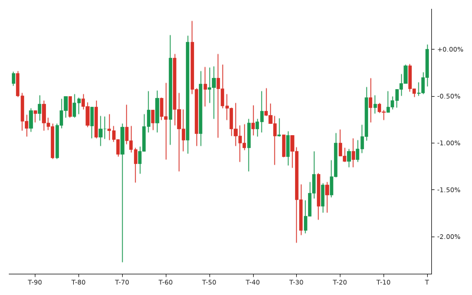

AI summary: Price spent the left and middle portion moving choppily downward with a deep shakeout, then formed a strong recovery from around the T-30 area. At the right edge it has pushed back up to the prior high zone and is testing the top of the recent advance.
AI context: Before the current setup, price was in a broad, noisy decline with a sharp low around T-30, then reversed upward in a stair-step rally.
AI location: The right edge is pressing into the prior swing high / local resistance near the +0.00% area after reclaiming the -0.50% to -0.20% region.
AI development: A selloff into the T-30 low was followed by a sequence of higher lows and higher highs. The advance continued into the final candles, culminating in a push into the prior peak zone with a tall bullish candle at the edge.
AI trigger: A completed candle that closes above the prior swing high / the +0.00% level at the right edge.

| condition | ok | detail |
|---|---|---|
| A1 recent swing high and up-leg > q33 | ok | swing high idx 91 (recent from 48), UP 0.7401 vs q33 0.1889 |
| A2 compact right edge ZR <= q33 | NO | ZR 0.6965 vs q33 0.3754 |
| A3 close near the top DT <= q33 | ok | DT 0.0202 vs q33 0.0890 (level 108887.90) |

### S0472 (2026-02-13T15:15:00+00:00) - present at T: False, present at T-1: False, fired on last two: False
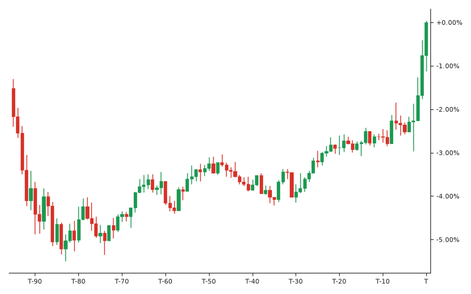

AI summary: Price sold off sharply on the left, then spent a long stretch building a choppy base and stepping higher in waves. At the far right it has accelerated upward in a near-vertical push into new highs relative to the visible range.
AI context: After the early decline and bottoming process, price transitioned into a series of higher swings and higher lows, with the climb becoming more forceful near the right edge.
AI location: The current move is pressing through the prior swing highs near the right edge and has reached the top of the visible range, with the latest candles extending above the earlier consolidation band.
AI development: A prolonged base formed after the drop, then price broke upward through successive minor highs, held above pullbacks, and most recently expanded sharply with a strong bullish impulse on the last few candles.
AI trigger: A completed candle closing above the prior visible swing high / breakout area at the far right edge, with the latest surge holding near the highs.

| condition | ok | detail |
|---|---|---|
| A1 recent swing high and up-leg > q33 | ok | swing high idx 88 (recent from 48), UP 0.2233 vs q33 0.1889 |
| A2 compact right edge ZR <= q33 | NO | ZR 0.5650 vs q33 0.3754 |
| A3 close near the top DT <= q33 | ok | DT 0.0063 vs q33 0.0890 (level 68888.00) |

### S0500 (2026-05-04T03:15:00+00:00) - present at T: False, present at T-1: False, fired on last two: False
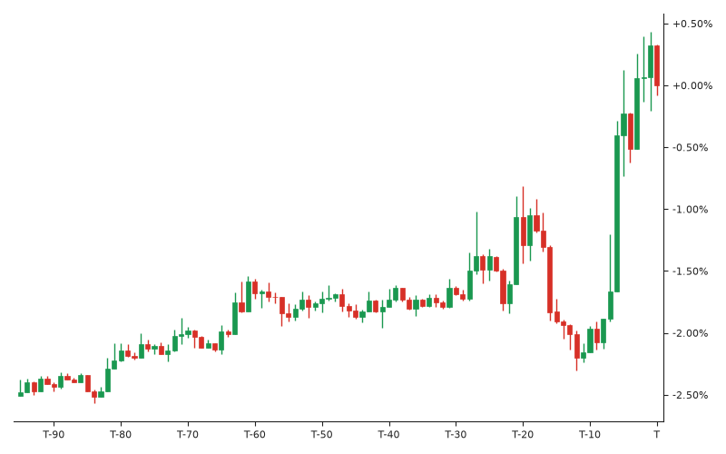

AI summary: Price spent most of the chart in a sideways-to-slightly-rising range after an early dip, then broke sharply upward from a late pullback near the right edge. The last candles show a fast vertical advance into fresh highs followed by a pullback candle from the peak.
AI context: Before the current move, price was compressing and chopping in a roughly flat band, then dipped and stabilized near the lower end of that range.
AI location: The current move has broken above the prior cluster of highs from the range and is now reacting around the newest high near the top-right of the chart.
AI development: A late base formed near the recent lows, then successive strong green candles drove price sharply higher through the prior ceiling, reaching above the previous swing highs, and the last candle pulled back from the extreme.
AI trigger: A completed candle that closes above the prior high cluster / breakout level, which has already occurred on the strong green surge candle.

| condition | ok | detail |
|---|---|---|
| A1 recent swing high and up-leg > q33 | ok | swing high idx 75 (recent from 48), UP 0.3419 vs q33 0.1889 |
| A2 compact right edge ZR <= q33 | NO | ZR 0.9131 vs q33 0.3754 |
| A3 close near the top DT <= q33 | NO | DT 0.1434 vs q33 0.0890 (level 80426.00) |

### S0535 (2026-05-10T16:30:00+00:00) - present at T: False, present at T-1: False, fired on last two: False
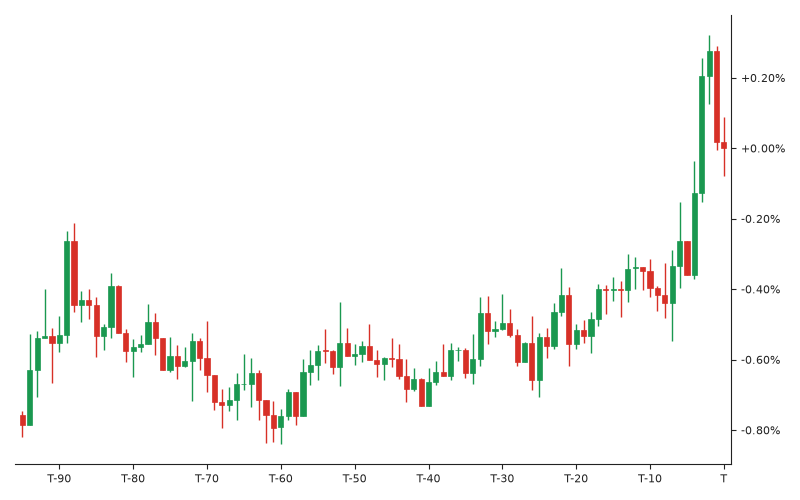

AI summary: Price spent most of the chart in a choppy sideways-to-down range, then accelerated sharply upward into the right edge. At the far right there is a steep vertical spike followed by a small pullback and a last candle sitting near the breakout area.
AI context: Before the final surge, price was range-bound and gradually basing around the -0.6% to -0.4% area after an earlier decline.
AI location: The current action is at the top of the abrupt spike, just above the prior consolidation highs and near the +0.20% region on the right axis.
AI development: A long sideways/downward chop transitioned into a higher low sequence, then a strong breakout candle(s) pushed price rapidly upward through prior local highs, reaching the current peak and then easing back slightly.
AI trigger: A completed candle closing above the prior swing high / consolidation ceiling near the breakout zone, confirming the upward break.

| condition | ok | detail |
|---|---|---|
| A1 recent swing high and up-leg > q33 | ok | swing high idx 82 (recent from 48), UP 0.2743 vs q33 0.1889 |
| A2 compact right edge ZR <= q33 | NO | ZR 0.8108 vs q33 0.3754 |
| A3 close near the top DT <= q33 | NO | DT 0.2762 vs q33 0.0890 (level 81475.00) |

## S2 bullish_rebound_breakout_after_drop: 1 cited charts, recognized (present at T or fired on the last two candles): 0

Charts failing each condition: {"B2 close above the low and rebound > q33": 1}
Charts missing by exactly one condition: {"B2 close above the low and rebound > q33": 1}

### S0492 (2025-09-04T08:00:00+00:00) - present at T: False, present at T-1: False, fired on last two: False
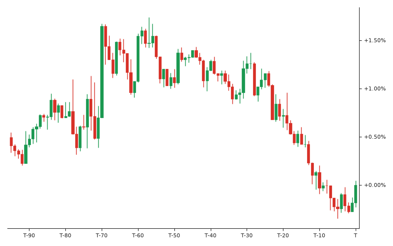

AI summary: Price rose early, then formed a broad choppy top and rolled over into a sustained decline. At the right edge it has fallen toward the zero line and is showing a small bounce after making fresh local lows.
AI context: After the mid-chart peak, price spent time making lower highs and lower lows, then accelerated downward into the right edge.
AI location: The current bounce is occurring immediately after a downward leg that broke below the prior short-term swing lows near the right side, with price still sitting near the lowest visible area.
AI development: A sequence of lower highs and lower lows developed from the mid-right area, then the decline steepened into the last several candles, followed by a small rebound off the lows on the final candle.
AI trigger: A completed candle that closes back above the most recent minor swing high of this rebound, after the downward break, would make the short-term reversal setup actionable.

| condition | ok | detail |
|---|---|---|
| B1 recent swing low and decline >= q67 | ok | swing low idx 90, DN 0.6257 vs q67 0.3316 |
| B2 close above the low and rebound > q33 | NO | close 110621.30 vs low 110237.2, REB 0.1878 vs q33 0.1886 |
| B3 pressing into the rebound high DT <= q33 | ok | DT 0.0211 vs q33 0.0618 |

## S3 bearish_breakdown_from_right_edge_range: 15 cited charts, recognized (present at T or fired on the last two candles): 2

Charts failing each condition: {"C3a sideways/choppy EFF <= q33": 13, "C3d near the floor DF <= q33": 5, "C3b roll-over high in the upper third of the right edge": 3, "C3c close in the lower third and below 3 candles ago": 2}
Charts missing by exactly one condition: {"C3a sideways/choppy EFF <= q33": 7, "C3d near the floor DF <= q33": 1}

### S0051 (2026-04-25T17:15:00+00:00) - present at T: False, present at T-1: False, fired on last two: False
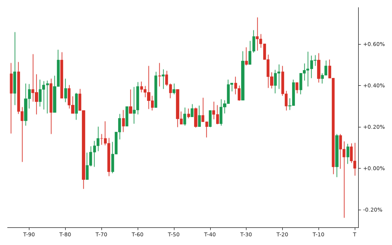

AI summary: Price chopped around in a range, then pushed up into a peak near the upper part of the chart, and finally sold off sharply into the right edge. The last candles show a steep drop, a brief bounce, and then another push lower near the current low area.
AI context: Before the right-edge move, price was oscillating in a broad sideways range with repeated swings between roughly the mid and upper part of the chart.
AI location: The current area sits just after a sharp breakdown from the recent local highs, with price testing and slightly undercutting the low area of the drop near the zero line and the prior intraday support zone.
AI development: Price formed a swing high near the +0.60% area, then turned down hard with a large red candle, bounced weakly with small candles, and rolled over again to challenge the recent low.
AI trigger: A completed candle closing below the low of the sharp selloff/nearby support area after the brief bounce makes the downside continuation readable.

| condition | ok | detail |
|---|---|---|
| C3a sideways/choppy EFF <= q33 | NO | EFF 0.2546 vs q33 0.1079 |
| C3b roll-over high in the upper third of the right edge | ok | swing high idx 82 (edge from 72), position 1.0000 |
| C3c close in the lower third and below 3 candles ago | ok | position 0.2974, close 77284.10 vs 77327.00 |
| C3d near the floor DF <= q33 | NO | DF 0.2465 vs q33 0.1397 |

### S0055 (2025-12-04T14:45:00+00:00) - present at T: False, present at T-1: False, fired on last two: False
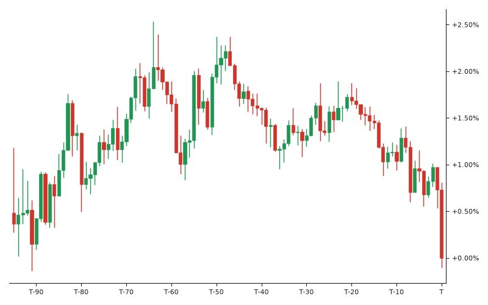

AI summary: Price climbed strongly from the left into a series of higher swings, then turned into a broad topping area and rolled over. At the right edge there is a sharp selloff candle breaking down from the recent lower-right consolidation.
AI context: Before the current move, price had already been falling from the mid-chart peak and had been making lower highs into a short sideways-to-down cluster near the right edge.
AI location: The last candle breaks below the immediate cluster of recent candles near the lower-right side, after failing to reclaim the small bounce area around the prior few bars.
AI development: A multi-swing rise topped near the middle-right, then price drifted down in steps, briefly bounced, and has now printed a large bearish candle that pushes through the recent local support area.
AI trigger: A completed candle closing well below the immediately preceding right-edge range/support, with clear bearish follow-through from the prior bounce zone.

| condition | ok | detail |
|---|---|---|
| C3a sideways/choppy EFF <= q33 | NO | EFF 0.4380 vs q33 0.1079 |
| C3b roll-over high in the upper third of the right edge | ok | swing high idx 87 (edge from 72), position 0.7579 |
| C3c close in the lower third and below 3 candles ago | ok | position 0.0530, close 91859.40 vs 92614.70 |
| C3d near the floor DF <= q33 | ok | DF 0.0397 vs q33 0.1397 |

### S0096 (2025-09-21T01:45:00+00:00) - present at T: False, present at T-1: False, fired on last two: False
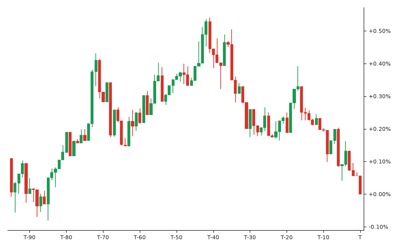

AI summary: Price climbed from the left, made a rounded top near the middle-right, then sold off in a sequence of lower highs and lower lows into the right edge. The last few candles are a small bounce attempt followed by renewed weakness back toward the lows.
AI context: After the mid-chart peak, price pulled back, rebounded, and then rolled over into a steady decline.
AI location: The current price is pressing down through the lower part of the recent downswing, near the cluster of lows formed over the last several candles after the rebound from around +0.30%.
AI development: A sharp rise into the +0.50% area was followed by a drop, then a smaller rebound around +0.30%, and then another selloff that has continued into the right edge with consecutive bearish candles.
AI trigger: A completed candle that closes below the most recent local swing low from the last few candles on the right side, confirming continuation of the current downside break.

| condition | ok | detail |
|---|---|---|
| C3a sideways/choppy EFF <= q33 | NO | EFF 0.2295 vs q33 0.1079 |
| C3b roll-over high in the upper third of the right edge | NO | swing high idx 89 (edge from 72), position 0.5219 |
| C3c close in the lower third and below 3 candles ago | ok | position 0.0002, close 115435.10 vs 115520.40 |
| C3d near the floor DF <= q33 | ok | DF 0.0001 vs q33 0.1397 |

### S0126 (2025-11-28T14:45:00+00:00) - present at T: False, present at T-1: False, fired on last two: False
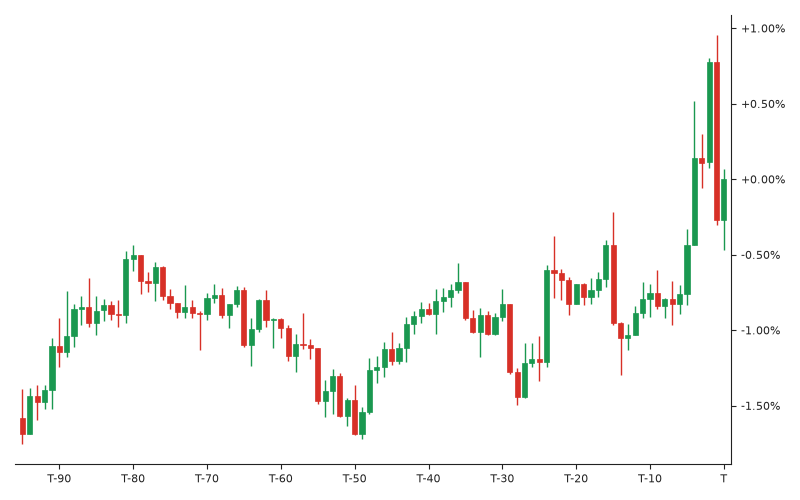

AI summary: Price spent most of the chart in a choppy range/slight downtrend, then rallied sharply from around the -1.0% area to above flat. At the right edge it has stalled after the spike and is pulling back with a strong red candle from the highs.
AI context: After the long mid-chart decline and base near the -1.6% to -1.3% area, price turned up and pushed aggressively higher into the right edge.
AI location: The current candles are testing the prior breakout/push area near the top of the recent move, with the last red candle rejecting from just under the +1.0% high and dropping back toward the 0% line.
AI development: A vertical green breakout move carried price from below -0.5% to around +0.8%/+0.9%, followed by a small hesitation and then a red reversal candle back down toward flat.
AI trigger: A completed candle closing back below the breakout area around 0% after failing at the recent highs.

| condition | ok | detail |
|---|---|---|
| C3a sideways/choppy EFF <= q33 | NO | EFF 0.1295 vs q33 0.1079 |
| C3b roll-over high in the upper third of the right edge | NO | swing high idx 86 (edge from 72), position 0.3088 |
| C3c close in the lower third and below 3 candles ago | NO | position 0.5764, close 92202.10 vs 92303.80 |
| C3d near the floor DF <= q33 | NO | DF 0.4790 vs q33 0.1397 |

### S0148 (2025-12-15T15:45:00+00:00) - present at T: False, present at T-1: False, fired on last two: False
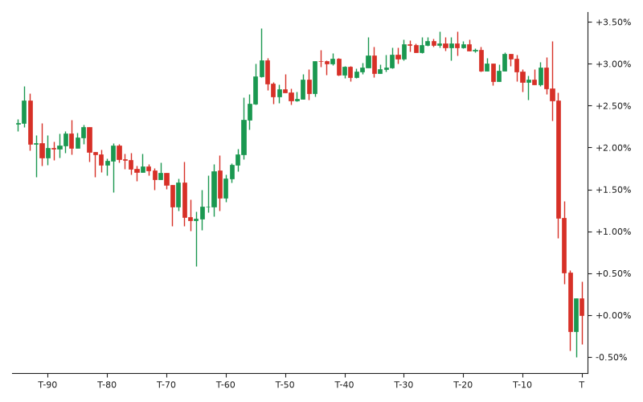

AI summary: Price drifted lower on the left, then surged sharply to a rounded top and spent time chopping near the highs. At the right edge it has broken down hard in a near-vertical selloff, with a small bounce and another red push into the present.
AI context: Price had been ranging near the top after a strong rally, then started to weaken from the elevated area before the selloff accelerated.
AI location: The current price is far below the prior high range and below the recent consolidation band, with the latest candles showing a decisive break under the short-term structure near the right edge.
AI development: A high-level plateau formed after the rally, then the candles rolled over from that area, followed by an abrupt multi-candle drop through the prior minor lows and into the lower end of the chart.
AI trigger: A completed candle closing well below the preceding short-term support band after the sharp drop.

| condition | ok | detail |
|---|---|---|
| C3a sideways/choppy EFF <= q33 | NO | EFF 0.5861 vs q33 0.1079 |
| C3b roll-over high in the upper third of the right edge | ok | swing high idx 90 (edge from 72), position 0.9719 |
| C3c close in the lower third and below 3 candles ago | ok | position 0.1282, close 86996.60 vs 87438.00 |
| C3d near the floor DF <= q33 | ok | DF 0.1270 vs q33 0.1397 |

### S0179 (2025-12-21T13:45:00+00:00) - present at T: False, present at T-1: False, fired on last two: True
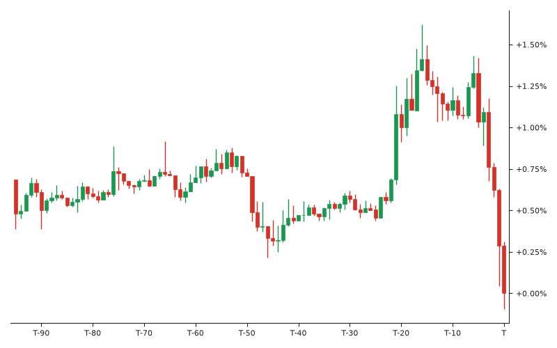

AI summary: Price spent the left and middle of the chart moving mostly sideways with a modest dip and recovery, then surged sharply higher into a peak near the right side. At the far right edge, it has reversed hard and is selling off in a sequence of large red candles back toward the +0.00% area.
AI context: After a prolonged range-bound phase, price pushed up strongly from around the mid-chart consolidation into a spike high near +1.5%, then stalled and started rolling over.
AI location: The current move is a sharp rejection from the recent high, with the last completed candles breaking down through the lower part of the post-spike pullback and approaching the prior breakout area near +0.00% to +0.25%.
AI development: A strong upswing made a local peak, followed by several smaller mixed candles under the peak. Then sellers took control with successive red candles, including a steep drop on the last completed candles.
AI trigger: A completed red candle that continues the downswing and closes at or near the +0.00% level after breaking below the immediate pullback structure from the spike high.

| condition | ok | detail |
|---|---|---|
| C3a sideways/choppy EFF <= q33 | NO | EFF 0.1698 vs q33 0.1079 |
| C3b roll-over high in the upper third of the right edge | ok | swing high idx 89 (edge from 72), position 0.8907 |
| C3c close in the lower third and below 3 candles ago | ok | position 0.0546, close 87630.50 vs 88299.20 |
| C3d near the floor DF <= q33 | ok | DF 0.0546 vs q33 0.1397 |

### S0192 (2025-11-16T21:30:00+00:00) - present at T: False, present at T-1: False, fired on last two: False
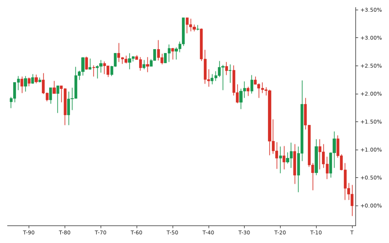

AI summary: Price rose steadily into a rounded peak near the middle of the chart, then sold off sharply and has been making lower highs and lower lows into the right edge. The most recent candles are a continued downswing pressing toward the zero line.
AI context: The chart shows a prior advance from the left side into a peak around +3.3%, followed by a multi-leg decline and then a choppy consolidation/rebound that failed below earlier highs.
AI location: The right edge is sitting below the prior minor swing lows from the brief bounce, with the latest candles breaking down from the lower-right consolidation area and approaching the chart low near 0.0%.
AI development: After the peak, price dropped strongly, paused in a sideways band, bounced briefly, and then resumed falling with successive bearish candles into the present. The last several candles show the rebound failing and the decline continuing.
AI trigger: A completed candle closing below the immediately preceding small swing low / the lower boundary of the recent right-edge consolidation.

| condition | ok | detail |
|---|---|---|
| C3a sideways/choppy EFF <= q33 | NO | EFF 0.1813 vs q33 0.1079 |
| C3b roll-over high in the upper third of the right edge | NO | swing high idx 90 (edge from 72), position 0.6262 |
| C3c close in the lower third and below 3 candles ago | ok | position 0.0756, close 93455.90 vs 94051.10 |
| C3d near the floor DF <= q33 | ok | DF 0.0516 vs q33 0.1397 |

### S0244 (2025-12-31T15:30:00+00:00) - present at T: False, present at T-1: False, fired on last two: False
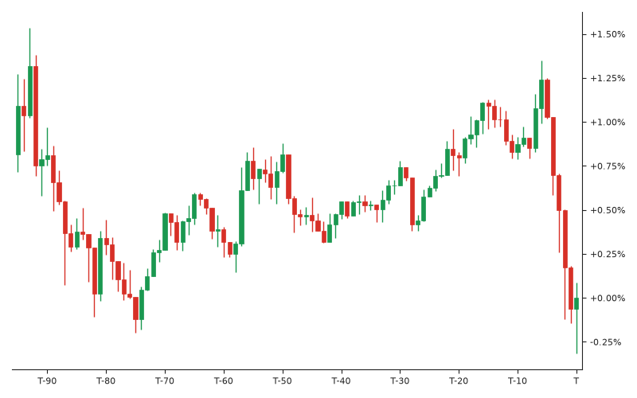

AI summary: Price fell hard from a swing high near the right side, then continued in a steep sequence of red candles into the present. The last candle is a small bounce after the drop, still sitting near the low of that selloff.
AI context: Before the drop, price had been rising into a local high on the right side after a broad choppy advance.
AI location: The current price is at the bottom edge of the recent downswing, after a sharp break from the prior swing high and after taking out several nearby rising candles.
AI development: An upswing into a local peak was followed by a cluster of strong red candles that drove price rapidly lower; the decline accelerated into the last few candles, with only a small rebound on the final bar.
AI trigger: A completed candle closing as a strong bearish continuation candle below the prior small consolidation/step-down area near the right edge.

| condition | ok | detail |
|---|---|---|
| C3a sideways/choppy EFF <= q33 | NO | EFF 0.2594 vs q33 0.1079 |
| C3b roll-over high in the upper third of the right edge | ok | swing high idx 89 (edge from 72), position 1.0000 |
| C3c close in the lower third and below 3 candles ago | ok | position 0.1893, close 88006.20 vs 88443.40 |
| C3d near the floor DF <= q33 | NO | DF 0.1704 vs q33 0.1397 |

### S0404 (2026-05-18T01:15:00+00:00) - present at T: False, present at T-1: False, fired on last two: False
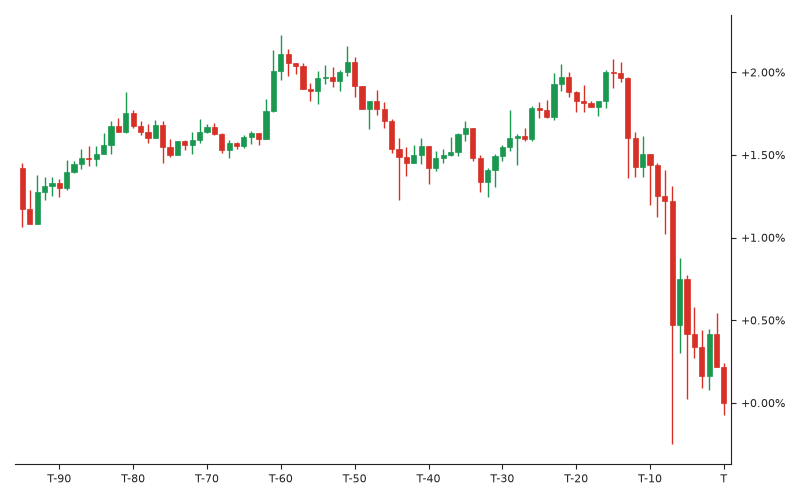

AI summary: Price drifted higher in a choppy rise, topped out near the +2.0% area, then rolled over and sold off sharply into the right edge. The most recent candles show a steep drop followed by a brief bounce and another push lower.
AI context: The chart spent the earlier middle section building and retesting highs around the +1.8% to +2.0% zone before breaking down.
AI location: The right edge is pressing below the prior rebound area after a near-vertical decline from the +2.0% region, with the latest candle testing around the 0.0% line and the preceding candles showing lower highs.
AI development: After the peak near T-20 to T-15, price made a series of lower highs and then accelerated downward; a small rebound appeared on a few candles, but the next candles immediately resumed selling and pushed to fresh local lows at the right edge.
AI trigger: A completed candle closing below the latest local low near the 0.0% area after the bounce.

| condition | ok | detail |
|---|---|---|
| C3a sideways/choppy EFF <= q33 | NO | EFF 0.5276 vs q33 0.1079 |
| C3b roll-over high in the upper third of the right edge | ok | swing high idx 80 (edge from 72), position 1.0000 |
| C3c close in the lower third and below 3 candles ago | ok | position 0.1064, close 76856.20 vs 76982.40 |
| C3d near the floor DF <= q33 | ok | DF 0.1002 vs q33 0.1397 |

### S0428 (2025-11-12T15:45:00+00:00) - present at T: False, present at T-1: False, fired on last two: False
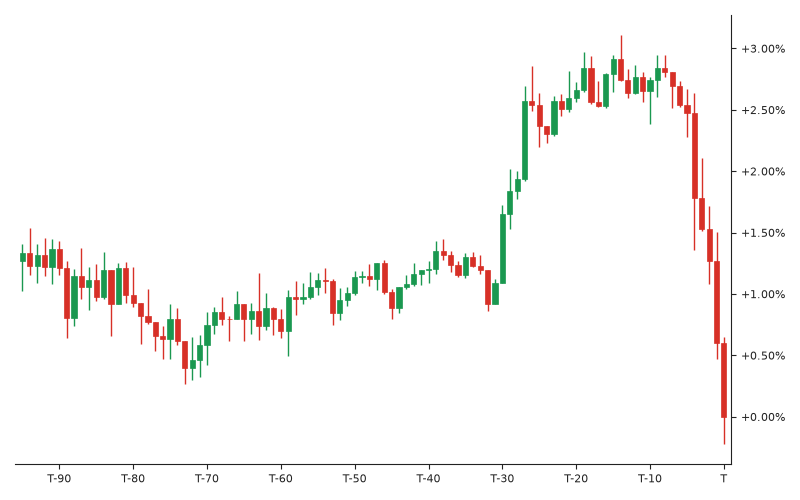

AI summary: Price drifted down and chopped sideways on the left, then built a steady rise into a sharp breakout to around the +2.5% to +3.0% area. At the right edge, price has reversed hard with a sequence of large red candles dropping back toward the opening/zero line.
AI context: A strong upswing and high-level consolidation formed after the mid-chart rise, with price holding near the top before the reversal began.
AI location: The current move is occurring directly off the prior peak/consolidation area near +2.8% to +3.0%, and the latest candles are breaking down through the lower edge of that recent range.
AI development: After the top, several small candles clustered near the highs, then the first larger red candle appeared, followed by additional red candles that extended the decline in a clear downward leg.
AI trigger: A completed candle closing below the most recent swing low / lower boundary of the post-peak range, confirming the breakdown already visible on the last completed candles.

| condition | ok | detail |
|---|---|---|
| C3a sideways/choppy EFF <= q33 | NO | EFF 0.5548 vs q33 0.1079 |
| C3b roll-over high in the upper third of the right edge | ok | swing high idx 87 (edge from 72), position 0.9526 |
| C3c close in the lower third and below 3 candles ago | ok | position 0.0662, close 102124.90 vs 103684.90 |
| C3d near the floor DF <= q33 | ok | DF 0.0662 vs q33 0.1397 |

### S0438 (2025-11-25T19:30:00+00:00) - present at T: False, present at T-1: False, fired on last two: False
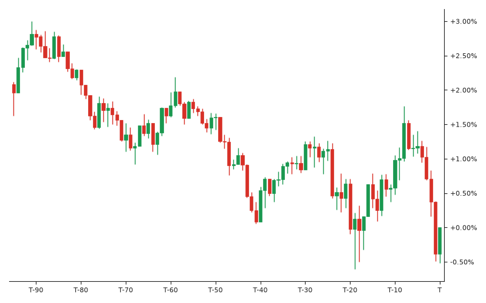

AI summary: Price trended down from an early high, then made a choppy rebound and rolled over again into a sharp selloff at the right edge. The last candles show a fast drop from roughly the +1% area to below 0% with little visible pause.
AI context: Before the current move, price had been oscillating in a broad range after a lower high near the right side, with repeated failed attempts to push higher.
AI location: The right edge is sitting at a fresh downside break below the prior local range, with the latest red candles extending the decline to a new visible low.
AI development: After a small rebound near the +1% area, price stalled, turned down, and then sold off in consecutive candles, breaking below the nearby swing low and continuing lower into the close.
AI trigger: A completed candle closing below the prior visible swing low / range floor at the right edge.

| condition | ok | detail |
|---|---|---|
| C3a sideways/choppy EFF <= q33 | ok | EFF 0.0821 vs q33 0.1079 |
| C3b roll-over high in the upper third of the right edge | ok | swing high idx 87 (edge from 72), position 1.0000 |
| C3c close in the lower third and below 3 candles ago | ok | position 0.2540, close 86582.80 vs 87195.50 |
| C3d near the floor DF <= q33 | NO | DF 0.1674 vs q33 0.1397 |

### S0439 (2026-04-05T06:00:00+00:00) - present at T: False, present at T-1: False, fired on last two: False
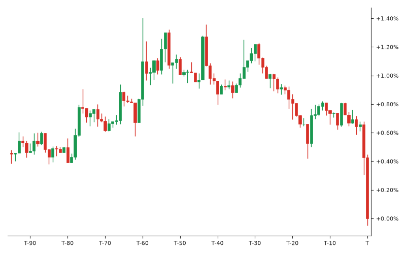

AI summary: Price rose from the left side in a choppy climb to a peak around the middle-left, then rolled over into a broader decline. At the right edge, a sharp red selloff has pushed price down to near the zero line after a small consolidation.
AI context: Before the current move, price spent several candles drifting lower from the prior swing high and then paused in a tight range near the +0.60 to +0.80 area.
AI location: The current candle is a clear bearish break below the recent sideways support/consolidation near the +0.60 area, and it is extending below the prior small swing lows on the right side.
AI development: A downswing formed after the mid-chart peak, price consolidated briefly around the +0.60 to +0.70 zone, then a large red candle broke down through that local range and accelerated lower.
AI trigger: A completed candle closing decisively below the recent right-side consolidation low and continuing the breakdown at the current right edge.

| condition | ok | detail |
|---|---|---|
| C3a sideways/choppy EFF <= q33 | NO | EFF 0.4901 vs q33 0.1079 |
| C3b roll-over high in the upper third of the right edge | ok | swing high idx 89 (edge from 72), position 0.8680 |
| C3c close in the lower third and below 3 candles ago | ok | position 0.0493, close 66620.20 vs 67049.30 |
| C3d near the floor DF <= q33 | ok | DF 0.0336 vs q33 0.1397 |

### S0486 (2026-02-05T04:15:00+00:00) - present at T: False, present at T-1: False, fired on last two: False
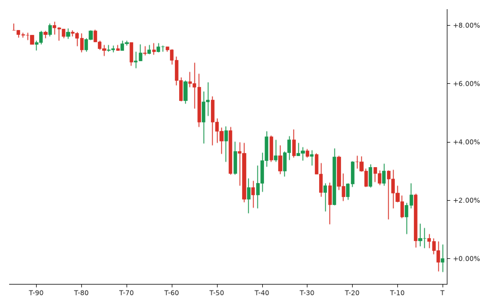

AI summary: Price has been in a broad downtrend from left to right, with a sharp selloff in the middle, a choppy mid-chart rebound, and another lower-high decline into the right edge. The last candles are pressing down to around the zero line after a series of weaker rebounds.
AI context: Before the current setup, price fell from the upper left, broke into a steeper decline around the middle, then bounced but failed to reclaim the prior highs.
AI location: The right edge is sitting at a test of the recent lows/zero area after a sequence of lower highs and lower lows, with the latest candles extending the decline into new local lows.
AI development: A sharp drop formed a lower swing low, a brief rebound stalled below earlier highs, and then selling resumed into the current downside push at the far right.
AI trigger: A completed candle closing below the most recent local low at the right edge, extending the existing decline to a fresh visible low.

| condition | ok | detail |
|---|---|---|
| C3a sideways/choppy EFF <= q33 | NO | EFF 0.2784 vs q33 0.1079 |
| C3b roll-over high in the upper third of the right edge | ok | swing high idx 88 (edge from 72), position 0.7636 |
| C3c close in the lower third and below 3 candles ago | ok | position 0.1138, close 70997.70 vs 71412.30 |
| C3d near the floor DF <= q33 | ok | DF 0.0528 vs q33 0.1397 |

### S0492 (2025-09-04T08:00:00+00:00) - present at T: False, present at T-1: False, fired on last two: False

AI summary: Price rose early, then formed a broad choppy top and rolled over into a sustained decline. At the right edge it has fallen toward the zero line and is showing a small bounce after making fresh local lows.
AI context: After the mid-chart peak, price spent time making lower highs and lower lows, then accelerated downward into the right edge.
AI location: The current bounce is occurring immediately after a downward leg that broke below the prior short-term swing lows near the right side, with price still sitting near the lowest visible area.
AI development: A sequence of lower highs and lower lows developed from the mid-right area, then the decline steepened into the last several candles, followed by a small rebound off the lows on the final candle.
AI trigger: A completed candle that closes back above the most recent minor swing high of this rebound, after the downward break, would make the short-term reversal setup actionable.

| condition | ok | detail |
|---|---|---|
| C3a sideways/choppy EFF <= q33 | NO | EFF 0.3108 vs q33 0.1079 |
| C3b roll-over high in the upper third of the right edge | ok | swing high idx 76 (edge from 72), position 0.9365 |
| C3c close in the lower third and below 3 candles ago | NO | position 0.2495, close 110621.30 vs 110384.40 |
| C3d near the floor DF <= q33 | NO | DF 0.1667 vs q33 0.1397 |

### S0521 (2026-01-02T14:15:00+00:00) - present at T: True, present at T-1: True, fired on last two: True
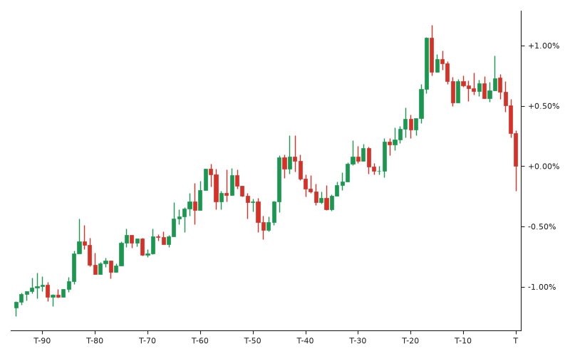

AI summary: Price climbed in a choppy uptrend from the left side to a peak near the upper right, then rolled over into a sharp selloff at the far right edge. The last candles show a fast drop from a short sideways-to-lower cluster near the highs.
AI context: Before the right-edge move, price was trending upward with a series of higher swings and a consolidation near the top after making a local peak.
AI location: The current drop is coming off the upper-right consolidation after a recent spike high, with the last bearish candles breaking below the nearby sideways range and the rising structure immediately below it.
AI development: An upward advance paused near the highs, price drifted sideways just under the peak, then bearish candles expanded downward and pushed through the lower edge of that recent range.
AI trigger: A completed bearish candle that closes below the recent sideways support area at the right edge after the high-level consolidation.

| condition | ok | detail |
|---|---|---|
| C3a sideways/choppy EFF <= q33 | ok | EFF 0.0704 vs q33 0.1079 |
| C3b roll-over high in the upper third of the right edge | ok | swing high idx 91 (edge from 72), position 0.8189 |
| C3c close in the lower third and below 3 candles ago | ok | position 0.1495, close 88862.40 vs 89407.90 |
| C3d near the floor DF <= q33 | ok | DF 0.0852 vs q33 0.1397 |

## S4 bearish_continuation_below_broken_support: 16 cited charts, recognized (present at T or fired on the last two candles): 0

Charts failing each condition: {"D3 lower high or lower low after the break": 15, "D4 a minor low after the break exists": 12, "D4 above the latest minor low and near it DF <= q33": 2, "D2 close still below the broken level": 2}
Charts missing by exactly one condition: {"D3 lower high or lower low after the break": 1}

### S0040 (2026-02-25T05:30:00+00:00) - present at T: False, present at T-1: False, fired on last two: False
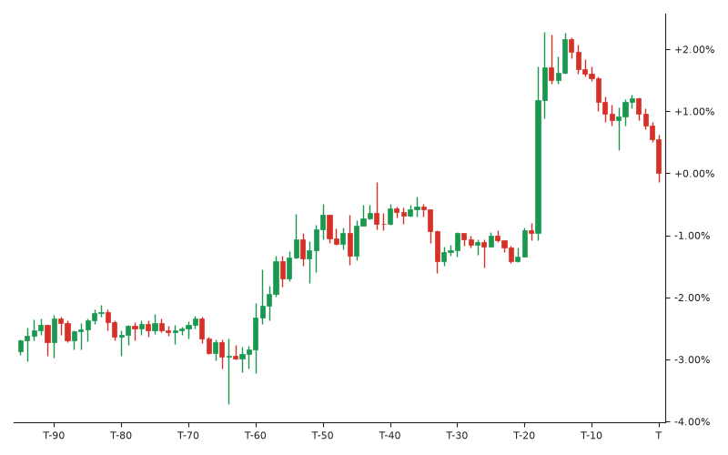

AI summary: Price spent the left side drifting and basing around the -2.5% to -3% area, then broke sharply higher into a strong spike to above +2%, followed by a pullback and a smaller descending sequence. At the right edge it is dropping again from around +1% toward flat after failing to hold the post-spike gains.
AI context: The chart had a long sideways-to-slightly-lower base, then a sudden impulsive rally that lifted price from around -1%/-2% to above +2%. After that surge, price has been retracing lower in a series of lower highs and lower lows.
AI location: The current move is testing the lower part of the post-spike pullback, near the area where the most recent rebound failed and where the sequence of higher-timeframe gains is being retraced.
AI development: After the vertical breakout, price topped out near +2% and started to roll over. It then printed a stair-step decline, attempted a smaller bounce, and has now turned down again with the latest candles pushing toward the prior intraday pullback lows.
AI trigger: A completed candle that breaks below the most recent swing low of the pullback after the spike, confirming continuation of the decline.

| condition | ok | detail |
|---|---|---|
| D1 a swing low was broken by a close | ok | break idx/level (95, 65053.9) |
| D2 close still below the broken level | ok | close 64809.90 vs broken level 65053.90 |
| D3 lower high or lower low after the break | NO | swing highs after break 0, lows 0; lower_high=False lower_low=False |
| D4 a minor low after the break exists | NO | none |

### S0051 (2026-04-25T17:15:00+00:00) - present at T: False, present at T-1: False, fired on last two: False

AI summary: Price chopped around in a range, then pushed up into a peak near the upper part of the chart, and finally sold off sharply into the right edge. The last candles show a steep drop, a brief bounce, and then another push lower near the current low area.
AI context: Before the right-edge move, price was oscillating in a broad sideways range with repeated swings between roughly the mid and upper part of the chart.
AI location: The current area sits just after a sharp breakdown from the recent local highs, with price testing and slightly undercutting the low area of the drop near the zero line and the prior intraday support zone.
AI development: Price formed a swing high near the +0.60% area, then turned down hard with a large red candle, bounced weakly with small candles, and rolled over again to challenge the recent low.
AI trigger: A completed candle closing below the low of the sharp selloff/nearby support area after the brief bounce makes the downside continuation readable.

| condition | ok | detail |
|---|---|---|
| D1 a swing low was broken by a close | ok | break idx/level (89, 77500.1) |
| D2 close still below the broken level | ok | close 77284.10 vs broken level 77500.10 |
| D3 lower high or lower low after the break | NO | swing highs after break 0, lows 1; lower_high=False lower_low=False |
| D4 above the latest minor low and near it DF <= q33 | NO | minor low 77100.00, DF 0.2465 vs q33 0.1162 |

### S0062 (2025-11-02T13:30:00+00:00) - present at T: False, present at T-1: False, fired on last two: False
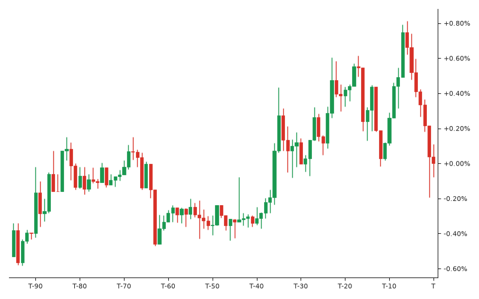

AI summary: Price sold off from a spike high near the right side, then has retraced in a sequence of red candles back toward the 0.00% area. The most recent candles show a clear downward move from the upper-right peak into the present edge.
AI context: Before this drop, price had rallied sharply from the mid-chart consolidation into a higher high near the top-right of the chart.
AI location: The current move is pressing down from the recent swing high and is approaching the horizontal 0.00% area after failing to hold above the +0.60% to +0.80% region.
AI development: A strong rise into the right-side peak was followed by several consecutive bearish candles, including a break below the nearby short-term pullback and continued lower closes.
AI trigger: A completed candle closing back below the 0.00% area after the right-side peak and pullback is the observable event that makes the short-side situation actionable.

| condition | ok | detail |
|---|---|---|
| D1 a swing low was broken by a close | ok | break idx/level (32, 110125.1) |
| D2 close still below the broken level | NO | close 110321.20 vs broken level 110125.10 |
| D3 lower high or lower low after the break | NO | swing highs after break 8, lows 6; lower_high=False lower_low=False |
| D4 above the latest minor low and near it DF <= q33 | ok | minor low 110302.10, DF 0.0124 vs q33 0.1162 |

### S0096 (2025-09-21T01:45:00+00:00) - present at T: False, present at T-1: False, fired on last two: False

AI summary: Price climbed from the left, made a rounded top near the middle-right, then sold off in a sequence of lower highs and lower lows into the right edge. The last few candles are a small bounce attempt followed by renewed weakness back toward the lows.
AI context: After the mid-chart peak, price pulled back, rebounded, and then rolled over into a steady decline.
AI location: The current price is pressing down through the lower part of the recent downswing, near the cluster of lows formed over the last several candles after the rebound from around +0.30%.
AI development: A sharp rise into the +0.50% area was followed by a drop, then a smaller rebound around +0.30%, and then another selloff that has continued into the right edge with consecutive bearish candles.
AI trigger: A completed candle that closes below the most recent local swing low from the last few candles on the right side, confirming continuation of the current downside break.

| condition | ok | detail |
|---|---|---|
| D1 a swing low was broken by a close | ok | break idx/level (95, 115483.1) |
| D2 close still below the broken level | ok | close 115435.10 vs broken level 115483.10 |
| D3 lower high or lower low after the break | NO | swing highs after break 0, lows 0; lower_high=False lower_low=False |
| D4 a minor low after the break exists | NO | none |

### S0126 (2025-11-28T14:45:00+00:00) - present at T: False, present at T-1: False, fired on last two: False

AI summary: Price spent most of the chart in a choppy range/slight downtrend, then rallied sharply from around the -1.0% area to above flat. At the right edge it has stalled after the spike and is pulling back with a strong red candle from the highs.
AI context: After the long mid-chart decline and base near the -1.6% to -1.3% area, price turned up and pushed aggressively higher into the right edge.
AI location: The current candles are testing the prior breakout/push area near the top of the recent move, with the last red candle rejecting from just under the +1.0% high and dropping back toward the 0% line.
AI development: A vertical green breakout move carried price from below -0.5% to around +0.8%/+0.9%, followed by a small hesitation and then a red reversal candle back down toward flat.
AI trigger: A completed candle closing back below the breakout area around 0% after failing at the recent highs.

| condition | ok | detail |
|---|---|---|
| D1 a swing low was broken by a close | ok | break idx/level (66, 91117.1) |
| D2 close still below the broken level | NO | close 92202.10 vs broken level 91117.10 |
| D3 lower high or lower low after the break | ok | swing highs after break 3, lows 3; lower_high=True lower_low=False |
| D4 above the latest minor low and near it DF <= q33 | NO | minor low 91314.40, DF 0.3559 vs q33 0.1162 |

### S0148 (2025-12-15T15:45:00+00:00) - present at T: False, present at T-1: False, fired on last two: False

AI summary: Price drifted lower on the left, then surged sharply to a rounded top and spent time chopping near the highs. At the right edge it has broken down hard in a near-vertical selloff, with a small bounce and another red push into the present.
AI context: Price had been ranging near the top after a strong rally, then started to weaken from the elevated area before the selloff accelerated.
AI location: The current price is far below the prior high range and below the recent consolidation band, with the latest candles showing a decisive break under the short-term structure near the right edge.
AI development: A high-level plateau formed after the rally, then the candles rolled over from that area, followed by an abrupt multi-candle drop through the prior minor lows and into the lower end of the chart.
AI trigger: A completed candle closing well below the preceding short-term support band after the sharp drop.

| condition | ok | detail |
|---|---|---|
| D1 a swing low was broken by a close | ok | break idx/level (92, 87504.3) |
| D2 close still below the broken level | ok | close 86996.60 vs broken level 87504.30 |
| D3 lower high or lower low after the break | NO | swing highs after break 0, lows 0; lower_high=False lower_low=False |
| D4 a minor low after the break exists | NO | none |

### S0160 (2026-05-07T15:30:00+00:00) - present at T: False, present at T-1: False, fired on last two: False
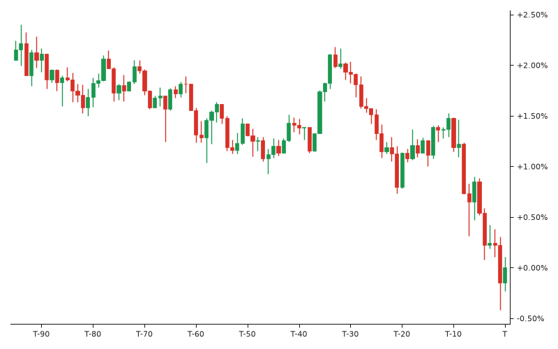

AI summary: Price trends downward overall from left to right, with a mid-chart rebound up to a local peak near the -30 area, then a steady decline into a sharp selloff at the right edge. The last candles are long red candles with a brief bounce attempt and then fresh downside push.
AI context: Before the current setup, price had already been falling from the mid-chart peak and was trading in a weak, lower-high structure.
AI location: The right edge is pressing below the prior minor base around the recent lows near the 0.00% area, after failing under the lower-high bounce from the -10 to -5 region.
AI development: A bounce formed after the decline, stalled below the earlier swing high, then sellers resumed control with consecutive red candles. The latest move extends the drop through the recent support area with expanding downside candles.
AI trigger: A completed candle closes below the recent swing low / base near the 0.00% area after the bounce failure.

| condition | ok | detail |
|---|---|---|
| D1 a swing low was broken by a close | ok | break idx/level (88, 80521.8) |
| D2 close still below the broken level | ok | close 79937.30 vs broken level 80521.80 |
| D3 lower high or lower low after the break | NO | swing highs after break 0, lows 0; lower_high=False lower_low=False |
| D4 a minor low after the break exists | NO | none |

### S0179 (2025-12-21T13:45:00+00:00) - present at T: False, present at T-1: False, fired on last two: False

AI summary: Price spent the left and middle of the chart moving mostly sideways with a modest dip and recovery, then surged sharply higher into a peak near the right side. At the far right edge, it has reversed hard and is selling off in a sequence of large red candles back toward the +0.00% area.
AI context: After a prolonged range-bound phase, price pushed up strongly from around the mid-chart consolidation into a spike high near +1.5%, then stalled and started rolling over.
AI location: The current move is a sharp rejection from the recent high, with the last completed candles breaking down through the lower part of the post-spike pullback and approaching the prior breakout area near +0.00% to +0.25%.
AI development: A strong upswing made a local peak, followed by several smaller mixed candles under the peak. Then sellers took control with successive red candles, including a steep drop on the last completed candles.
AI trigger: A completed red candle that continues the downswing and closes at or near the +0.00% level after breaking below the immediate pullback structure from the spike high.

| condition | ok | detail |
|---|---|---|
| D1 a swing low was broken by a close | ok | break idx/level (95, 87821.1) |
| D2 close still below the broken level | ok | close 87630.50 vs broken level 87821.10 |
| D3 lower high or lower low after the break | NO | swing highs after break 0, lows 0; lower_high=False lower_low=False |
| D4 a minor low after the break exists | NO | none |

### S0192 (2025-11-16T21:30:00+00:00) - present at T: False, present at T-1: False, fired on last two: False

AI summary: Price rose steadily into a rounded peak near the middle of the chart, then sold off sharply and has been making lower highs and lower lows into the right edge. The most recent candles are a continued downswing pressing toward the zero line.
AI context: The chart shows a prior advance from the left side into a peak around +3.3%, followed by a multi-leg decline and then a choppy consolidation/rebound that failed below earlier highs.
AI location: The right edge is sitting below the prior minor swing lows from the brief bounce, with the latest candles breaking down from the lower-right consolidation area and approaching the chart low near 0.0%.
AI development: After the peak, price dropped strongly, paused in a sideways band, bounced briefly, and then resumed falling with successive bearish candles into the present. The last several candles show the rebound failing and the decline continuing.
AI trigger: A completed candle closing below the immediately preceding small swing low / the lower boundary of the recent right-edge consolidation.

| condition | ok | detail |
|---|---|---|
| D1 a swing low was broken by a close | ok | break idx/level (94, 93714.7) |
| D2 close still below the broken level | ok | close 93455.90 vs broken level 93714.70 |
| D3 lower high or lower low after the break | NO | swing highs after break 0, lows 0; lower_high=False lower_low=False |
| D4 a minor low after the break exists | NO | none |

### S0244 (2025-12-31T15:30:00+00:00) - present at T: False, present at T-1: False, fired on last two: False

AI summary: Price fell hard from a swing high near the right side, then continued in a steep sequence of red candles into the present. The last candle is a small bounce after the drop, still sitting near the low of that selloff.
AI context: Before the drop, price had been rising into a local high on the right side after a broad choppy advance.
AI location: The current price is at the bottom edge of the recent downswing, after a sharp break from the prior swing high and after taking out several nearby rising candles.
AI development: An upswing into a local peak was followed by a cluster of strong red candles that drove price rapidly lower; the decline accelerated into the last few candles, with only a small rebound on the final bar.
AI trigger: A completed candle closing as a strong bearish continuation candle below the prior small consolidation/step-down area near the right edge.

| condition | ok | detail |
|---|---|---|
| D1 a swing low was broken by a close | ok | break idx/level (94, 88134.9) |
| D2 close still below the broken level | ok | close 88006.20 vs broken level 88134.90 |
| D3 lower high or lower low after the break | NO | swing highs after break 0, lows 0; lower_high=False lower_low=False |
| D4 a minor low after the break exists | NO | none |

### S0330 (2025-10-10T21:15:00+00:00) - present at T: False, present at T-1: False, fired on last two: False
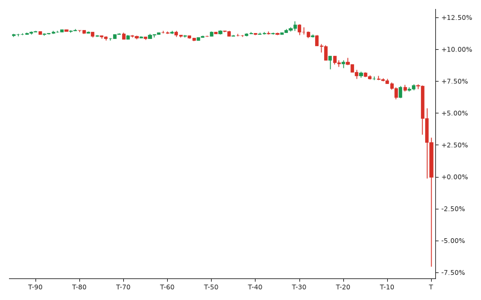

AI summary: Price spent most of the chart drifting sideways to slightly up near the top, then broke into a clear step-down decline. At the right edge it is in a very sharp selloff with consecutive large red candles and a new low spike.
AI context: Before the setup, price was ranging and then began to roll over from the upper area around the +11% to +12% zone.
AI location: The current move is at the chart’s right edge after a sequence of lower highs and lower lows, with a brief pause near the +7% area before the final breakdown to around 0% and below.
AI development: Sideways consolidation near the highs, then a gradual descent, then a faster selloff, a small pause/rebound near the recent lows, and finally a very large bearish candle that breaks beneath the prior low area.
AI trigger: A completed candle that expands the decline by closing below the prior low/support area near the recent right-edge base, confirming the breakdown already visible on the last candle.

| condition | ok | detail |
|---|---|---|
| D1 a swing low was broken by a close | ok | break idx/level (93, 115845.0) |
| D2 close still below the broken level | ok | close 109183.00 vs broken level 115845.00 |
| D3 lower high or lower low after the break | NO | swing highs after break 0, lows 0; lower_high=False lower_low=False |
| D4 a minor low after the break exists | NO | none |

### S0404 (2026-05-18T01:15:00+00:00) - present at T: False, present at T-1: False, fired on last two: False

AI summary: Price drifted higher in a choppy rise, topped out near the +2.0% area, then rolled over and sold off sharply into the right edge. The most recent candles show a steep drop followed by a brief bounce and another push lower.
AI context: The chart spent the earlier middle section building and retesting highs around the +1.8% to +2.0% zone before breaking down.
AI location: The right edge is pressing below the prior rebound area after a near-vertical decline from the +2.0% region, with the latest candle testing around the 0.0% line and the preceding candles showing lower highs.
AI development: After the peak near T-20 to T-15, price made a series of lower highs and then accelerated downward; a small rebound appeared on a few candles, but the next candles immediately resumed selling and pushed to fresh local lows at the right edge.
AI trigger: A completed candle closing below the latest local low near the 0.0% area after the bounce.

| condition | ok | detail |
|---|---|---|
| D1 a swing low was broken by a close | ok | break idx/level (87, 77811.5) |
| D2 close still below the broken level | ok | close 76856.20 vs broken level 77811.50 |
| D3 lower high or lower low after the break | NO | swing highs after break 0, lows 1; lower_high=False lower_low=False |
| D4 above the latest minor low and near it DF <= q33 | ok | minor low 76666.00, DF 0.1002 vs q33 0.1162 |

### S0428 (2025-11-12T15:45:00+00:00) - present at T: False, present at T-1: False, fired on last two: False

AI summary: Price drifted down and chopped sideways on the left, then built a steady rise into a sharp breakout to around the +2.5% to +3.0% area. At the right edge, price has reversed hard with a sequence of large red candles dropping back toward the opening/zero line.
AI context: A strong upswing and high-level consolidation formed after the mid-chart rise, with price holding near the top before the reversal began.
AI location: The current move is occurring directly off the prior peak/consolidation area near +2.8% to +3.0%, and the latest candles are breaking down through the lower edge of that recent range.
AI development: After the top, several small candles clustered near the highs, then the first larger red candle appeared, followed by additional red candles that extended the decline in a clear downward leg.
AI trigger: A completed candle closing below the most recent swing low / lower boundary of the post-peak range, confirming the breakdown already visible on the last completed candles.

| condition | ok | detail |
|---|---|---|
| D1 a swing low was broken by a close | ok | break idx/level (95, 102629.5) |
| D2 close still below the broken level | ok | close 102124.90 vs broken level 102629.50 |
| D3 lower high or lower low after the break | NO | swing highs after break 0, lows 0; lower_high=False lower_low=False |
| D4 a minor low after the break exists | NO | none |

### S0439 (2026-04-05T06:00:00+00:00) - present at T: False, present at T-1: False, fired on last two: False

AI summary: Price rose from the left side in a choppy climb to a peak around the middle-left, then rolled over into a broader decline. At the right edge, a sharp red selloff has pushed price down to near the zero line after a small consolidation.
AI context: Before the current move, price spent several candles drifting lower from the prior swing high and then paused in a tight range near the +0.60 to +0.80 area.
AI location: The current candle is a clear bearish break below the recent sideways support/consolidation near the +0.60 area, and it is extending below the prior small swing lows on the right side.
AI development: A downswing formed after the mid-chart peak, price consolidated briefly around the +0.60 to +0.70 zone, then a large red candle broke down through that local range and accelerated lower.
AI trigger: A completed candle closing decisively below the recent right-side consolidation low and continuing the breakdown at the current right edge.

| condition | ok | detail |
|---|---|---|
| D1 a swing low was broken by a close | ok | break idx/level (95, 66900.0) |
| D2 close still below the broken level | ok | close 66620.20 vs broken level 66900.00 |
| D3 lower high or lower low after the break | NO | swing highs after break 0, lows 0; lower_high=False lower_low=False |
| D4 a minor low after the break exists | NO | none |

### S0486 (2026-02-05T04:15:00+00:00) - present at T: False, present at T-1: False, fired on last two: False

AI summary: Price has been in a broad downtrend from left to right, with a sharp selloff in the middle, a choppy mid-chart rebound, and another lower-high decline into the right edge. The last candles are pressing down to around the zero line after a series of weaker rebounds.
AI context: Before the current setup, price fell from the upper left, broke into a steeper decline around the middle, then bounced but failed to reclaim the prior highs.
AI location: The right edge is sitting at a test of the recent lows/zero area after a sequence of lower highs and lower lows, with the latest candles extending the decline into new local lows.
AI development: A sharp drop formed a lower swing low, a brief rebound stalled below earlier highs, and then selling resumed into the current downside push at the far right.
AI trigger: A completed candle closing below the most recent local low at the right edge, extending the existing decline to a fresh visible low.

| condition | ok | detail |
|---|---|---|
| D1 a swing low was broken by a close | ok | break idx/level (89, 71950.0) |
| D2 close still below the broken level | ok | close 70997.70 vs broken level 71950.00 |
| D3 lower high or lower low after the break | NO | swing highs after break 0, lows 0; lower_high=False lower_low=False |
| D4 a minor low after the break exists | NO | none |

### S0521 (2026-01-02T14:15:00+00:00) - present at T: False, present at T-1: False, fired on last two: False

AI summary: Price climbed in a choppy uptrend from the left side to a peak near the upper right, then rolled over into a sharp selloff at the far right edge. The last candles show a fast drop from a short sideways-to-lower cluster near the highs.
AI context: Before the right-edge move, price was trending upward with a series of higher swings and a consolidation near the top after making a local peak.
AI location: The current drop is coming off the upper-right consolidation after a recent spike high, with the last bearish candles breaking below the nearby sideways range and the rising structure immediately below it.
AI development: An upward advance paused near the highs, price drifted sideways just under the peak, then bearish candles expanded downward and pushed through the lower edge of that recent range.
AI trigger: A completed bearish candle that closes below the recent sideways support area at the right edge after the high-level consolidation.

| condition | ok | detail |
|---|---|---|
| D1 a swing low was broken by a close | ok | break idx/level (94, 89306.2) |
| D2 close still below the broken level | ok | close 88862.40 vs broken level 89306.20 |
| D3 lower high or lower low after the break | NO | swing highs after break 0, lows 0; lower_high=False lower_low=False |
| D4 a minor low after the break exists | NO | none |

## S5 bullish_continuation_after_spike_and_pullback: 2 cited charts, recognized (present at T or fired on the last two candles): 0

Charts failing each condition: {"E4 near the spike high DT <= q33": 2}
Charts missing by exactly one condition: {"E4 near the spike high DT <= q33": 2}

### S0228 (2026-03-01T04:00:00+00:00) - present at T: False, present at T-1: False, fired on last two: False
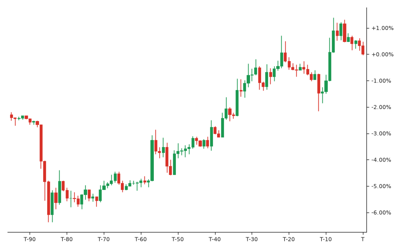

AI summary: Price sold off sharply on the left, then spent a long stretch basing and climbing in a stair-step advance. Near the right edge it pushed to a fresh high, pulled back a bit, and is now drifting lower from just above the 0% area.
AI context: After the initial drop, price formed a rounded base and then a sustained rally with higher highs and higher lows into the right side of the chart.
AI location: The current pullback is happening immediately after a breakout to a new visible high near the top of the chart, with price still holding above the 0% line and above the prior breakout area.
AI development: Price advanced from the mid-chart base, broke above the earlier swing highs, made a peak near +1%, then eased lower in several small red candles from that top.
AI trigger: A completed candle that reclaims the recent pullback high and closes back above the local top area near the +1% region would make the continuation setup actionable.

| condition | ok | detail |
|---|---|---|
| E0 two confirmed swing highs | ok | 10 confirmed swing highs |
| E1 recent spike high above the previous swing high, up-leg >= q67 | ok | spike idx 87, spike high 68189.00, previous swing high 67089.60, UP 0.4563 vs q67 0.3250 |
| E2 shallow pullback or tight range, no higher high since | ok | RET 0.4022 vs q33 0.6908; ZR 0.4563 vs q33 0.3754; max high since 68139.00 |
| E3 broke above the previous swing high (a close) and held above it | ok | first close above 67089.60: idx 86; lowest close since: 67257.2 |
| E4 near the spike high DT <= q33 | NO | DT 0.1789 vs q33 0.1015 |

### S0302 (2026-03-15T03:45:00+00:00) - present at T: False, present at T-1: False, fired on last two: False
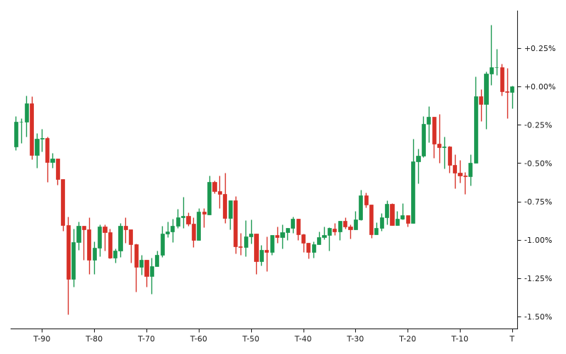

AI summary: Price fell sharply on the left, then spent a long middle section chopping in a broad low range. Near the right edge it broke upward aggressively, pulled back, and is now sitting near the prior breakout area after a push to fresh highs.
AI context: After the early selloff, price moved sideways-to-choppy in a depressed range before the late sharp advance.
AI location: The right edge is testing the area just below/around the recent breakout surge and the prior local highs near the top of the latest upswing.
AI development: A prolonged low-range consolidation was followed by a strong impulsive rally. That rally was then met by a small pullback and a brief pause near the highs, leaving the last candles clustered around the breakout zone.
AI trigger: A completed candle that closes back above the recent pullback highs / holds above the breakout area after the surge.

| condition | ok | detail |
|---|---|---|
| E0 two confirmed swing highs | ok | 9 confirmed swing highs |
| E1 recent spike high above the previous swing high, up-leg >= q67 | ok | spike idx 91, spike high 71599.90, previous swing high 71221.90, UP 0.5835 vs q67 0.3250 |
| E2 shallow pullback or tight range, no higher high since | ok | RET 0.5529 vs q33 0.6908; ZR 0.6980 vs q33 0.3754; max high since 71489.60 |
| E3 broke above the previous swing high (a close) and held above it | ok | first close above 71221.90: idx 88; lowest close since: 71232.3 |
| E4 near the spike high DT <= q33 | NO | DT 0.2121 vs q33 0.1015 |

## S6 bearish_rejection_from_recent_high: 4 cited charts, recognized (present at T or fired on the last two candles): 1

Charts failing each condition: {"F3 up-leg > q33 and retracement in (q33, 1.0]": 4, "F4 near the pullback low DF <= q33": 2, "F1 recent swing high in the top third of the window": 1, "F2 no close above the high since, close below it": 1}
Charts missing by exactly one condition: {"F3 up-leg > q33 and retracement in (q33, 1.0]": 2}

### S0040 (2026-02-25T05:30:00+00:00) - present at T: False, present at T-1: False, fired on last two: False

AI summary: Price spent the left side drifting and basing around the -2.5% to -3% area, then broke sharply higher into a strong spike to above +2%, followed by a pullback and a smaller descending sequence. At the right edge it is dropping again from around +1% toward flat after failing to hold the post-spike gains.
AI context: The chart had a long sideways-to-slightly-lower base, then a sudden impulsive rally that lifted price from around -1%/-2% to above +2%. After that surge, price has been retracing lower in a series of lower highs and lower lows.
AI location: The current move is testing the lower part of the post-spike pullback, near the area where the most recent rebound failed and where the sequence of higher-timeframe gains is being retraced.
AI development: After the vertical breakout, price topped out near +2% and started to roll over. It then printed a stair-step decline, attempted a smaller bounce, and has now turned down again with the latest candles pushing toward the prior intraday pullback lows.
AI trigger: A completed candle that breaks below the most recent swing low of the pullback after the spike, confirming continuation of the decline.

| condition | ok | detail |
|---|---|---|
| F1 recent swing high in the top third of the window | ok | swing high idx 91, height 0.8311 |
| F2 no close above the high since, close below it | ok | close 64809.90 vs high 65627.5 |
| F3 up-leg > q33 and retracement in (q33, 1.0] | NO | UP 0.1478 vs q33 0.1889; RET 1.5814 vs q33 0.6908 |
| F4 near the pullback low DF <= q33 | ok | DF 0.0231 vs q33 0.0651 |

### S0062 (2025-11-02T13:30:00+00:00) - present at T: False, present at T-1: False, fired on last two: True

AI summary: Price sold off from a spike high near the right side, then has retraced in a sequence of red candles back toward the 0.00% area. The most recent candles show a clear downward move from the upper-right peak into the present edge.
AI context: Before this drop, price had rallied sharply from the mid-chart consolidation into a higher high near the top-right of the chart.
AI location: The current move is pressing down from the recent swing high and is approaching the horizontal 0.00% area after failing to hold above the +0.60% to +0.80% region.
AI development: A strong rise into the right-side peak was followed by several consecutive bearish candles, including a break below the nearby short-term pullback and continued lower closes.
AI trigger: A completed candle closing back below the 0.00% area after the right-side peak and pullback is the observable event that makes the short-side situation actionable.

| condition | ok | detail |
|---|---|---|
| F1 recent swing high in the top third of the window | ok | swing high idx 89, height 1.0000 |
| F2 no close above the high since, close below it | ok | close 110321.20 vs high 111216.0 |
| F3 up-leg > q33 and retracement in (q33, 1.0] | NO | UP 0.5948 vs q33 0.1889; RET 1.2111 vs q33 0.6908 |
| F4 near the pullback low DF <= q33 | NO | DF 0.1380 vs q33 0.0651 |

### S0179 (2025-12-21T13:45:00+00:00) - present at T: False, present at T-1: False, fired on last two: False

AI summary: Price spent the left and middle of the chart moving mostly sideways with a modest dip and recovery, then surged sharply higher into a peak near the right side. At the far right edge, it has reversed hard and is selling off in a sequence of large red candles back toward the +0.00% area.
AI context: After a prolonged range-bound phase, price pushed up strongly from around the mid-chart consolidation into a spike high near +1.5%, then stalled and started rolling over.
AI location: The current move is a sharp rejection from the recent high, with the last completed candles breaking down through the lower part of the post-spike pullback and approaching the prior breakout area near +0.00% to +0.25%.
AI development: A strong upswing made a local peak, followed by several smaller mixed candles under the peak. Then sellers took control with successive red candles, including a steep drop on the last completed candles.
AI trigger: A completed red candle that continues the downswing and closes at or near the +0.00% level after breaking below the immediate pullback structure from the spike high.

| condition | ok | detail |
|---|---|---|
| F1 recent swing high in the top third of the window | ok | swing high idx 89, height 0.8907 |
| F2 no close above the high since, close below it | ok | close 87630.50 vs high 88885.9 |
| F3 up-leg > q33 and retracement in (q33, 1.0] | NO | UP 0.2330 vs q33 0.1889; RET 3.8222 vs q33 0.6908 |
| F4 near the pullback low DF <= q33 | ok | DF 0.0546 vs q33 0.0651 |

### S0525 (2026-04-14T14:30:00+00:00) - present at T: False, present at T-1: False, fired on last two: False
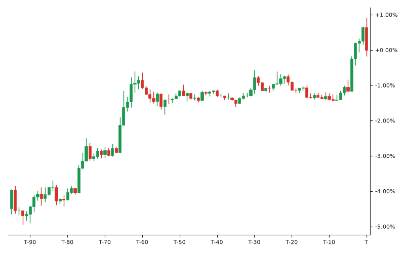

AI summary: Price spent the left and middle of the chart building upward in steps, then moved into a choppy sideways band before a sharp rally at the far right. The last candle is a large red pullback immediately after that spike, coming from just above the 0% area.
AI context: Before the right-edge move, price was basing in a roughly horizontal range after the earlier advance, with repeated swings between about the -1.5% and -1.0% area.
AI location: The interesting feature is the failed-looking push into the recent high near the +1.0% area followed by a bearish reversal candle at the right edge, after a fast vertical move from the prior range.
AI development: Sideways consolidation under the recent highs, then a steep upward breakout toward the top of the chart, then a strong red candle pulling back from that breakout high.
AI trigger: A completed candle that breaks back down from the spike and closes materially below the prior green candle's body, showing rejection of the breakout.

| condition | ok | detail |
|---|---|---|
| F1 recent swing high in the top third of the window | NO | swing high idx 84, height 0.6419 |
| F2 no close above the high since, close below it | NO | close 75325.60 vs high 74430.0 |
| F3 up-leg > q33 and retracement in (q33, 1.0] | NO | UP 0.0025 vs q33 0.1889; RET 17.9817 vs q33 0.6908 |
| F4 near the pullback low DF <= q33 | NO | DF 0.2476 vs q33 0.0651 |

## S7 bullish_breakout_from_right_edge_range: 12 cited charts, recognized (present at T or fired on the last two candles): 3

Charts failing each condition: {"H1 a decline preceded: DN > q33": 5, "H3 near the local high DT <= q33": 5, "H2 rebound > q33 or compact edge": 1}
Charts missing by exactly one condition: {"H1 a decline preceded: DN > q33": 4, "H3 near the local high DT <= q33": 4}

### S0022 (2026-01-14T15:00:00+00:00) - present at T: False, present at T-1: False, fired on last two: False
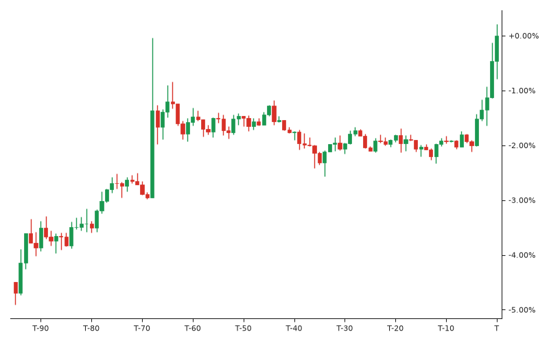

AI summary: Price climbed from around -5% to about -2.5%, then made a sharp vertical spike up and spent a long stretch moving sideways to slightly down around the -1.5% to -2.2% area. At the right edge it has broken upward out of that range with several strong green candles and is pressing into the zero area.
AI context: After the spike, price ranged and drifted lower in a choppy consolidation below the prior spike high, repeatedly holding around the -2% zone.
AI location: The current move is occurring at the upper edge of the consolidation and through the prior local high/ceiling near the -1% to -1.5% region, with the last candles extending above the range.
AI development: Strong rally into a spike high, then a prolonged sideways pullback/consolidation, then a renewed push higher starting from around -2% and accelerating into the right edge.
AI trigger: A completed candle that closes clearly above the consolidation ceiling and the prior local high near the top of the range, confirming breakout.

| condition | ok | detail |
|---|---|---|
| H1 a decline preceded: DN > q33 | NO | DN 0.0832 vs q33 0.1845 |
| H2 rebound > q33 or compact edge | ok | REB 0.4555 vs q33 0.1886; ZR 0.4962 vs q33 0.3754 |
| H3 near the local high DT <= q33 | ok | DT 0.0404 vs q33 0.1307 |

### S0056 (2025-10-04T23:45:00+00:00) - present at T: False, present at T-1: False, fired on last two: False
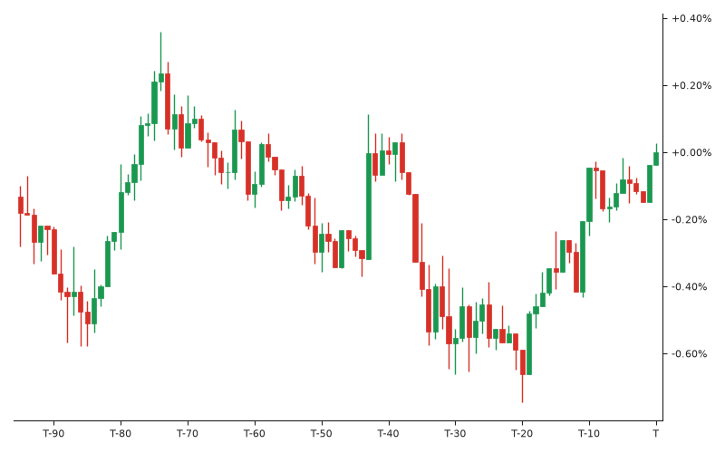

AI summary: Price fell into a low around the T-20 area, then turned up sharply in a step-like advance. At the right edge it has continued higher from a shallow pullback and is pressing back to the flat/near-zero area.
AI context: Before the current setup, price sold off into the T-20 low zone and then rebounded strongly.
AI location: The right-edge advance is occurring after a clear bounce from the prior low, with the latest candles pushing through the near-flat level around 0.00 and above the prior short pullback highs.
AI development: A sharp rally from the T-20 low was followed by a brief pause/pullback, then a sequence of higher candles lifted price back toward the recent highs.
AI trigger: A completed candle closing above the most recent local swing high near the right edge and holding above the near-0.00 area.

| condition | ok | detail |
|---|---|---|
| H1 a decline preceded: DN > q33 | NO | DN 0.1794 vs q33 0.1845 |
| H2 rebound > q33 or compact edge | ok | REB 0.4161 vs q33 0.1886; ZR 0.6988 vs q33 0.3754 |
| H3 near the local high DT <= q33 | ok | DT 0.0234 vs q33 0.1307 |

### S0099 (2026-04-13T21:00:00+00:00) - present at T: False, present at T-1: False, fired on last two: False
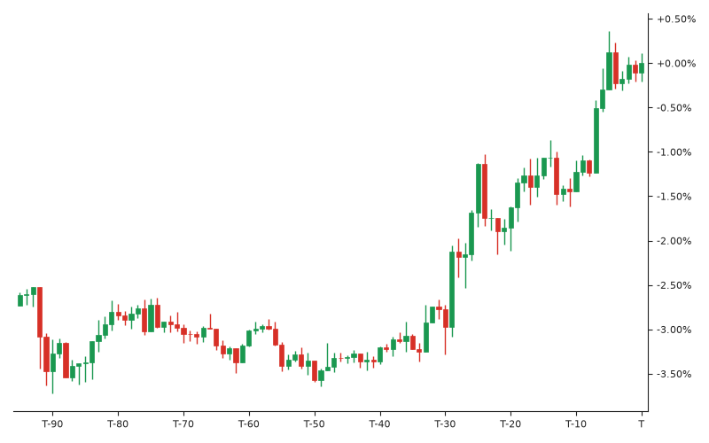

AI summary: Price spent most of the left side drifting and chopping lower around the -3% to -3.5% area, then began a strong vertical advance from around T-30. At the right edge it has pushed into the +0% area after a sharp spike and small consolidation.
AI context: Before the current setup, price was range-bound and then transitioned into a steep upside impulse from the lower consolidation area.
AI location: The current price is pressing against the recent highs near the top of the move, after breaking well above the prior sideways range and into positive territory.
AI development: A strong rally started near T-30, followed by a sequence of higher highs and higher lows. Near the right edge, price spiked up, pulled back modestly, and then retested the upper area with small candles around the local high.
AI trigger: A completed candle closing above the immediately prior swing high / top of the recent spike at the right edge.

| condition | ok | detail |
|---|---|---|
| H1 a decline preceded: DN > q33 | NO | DN 0.1841 vs q33 0.1845 |
| H2 rebound > q33 or compact edge | ok | REB 0.4832 vs q33 0.1886; ZR 0.6173 vs q33 0.3754 |
| H3 near the local high DT <= q33 | ok | DT 0.0877 vs q33 0.1307 |

### S0121 (2026-02-02T16:00:00+00:00) - present at T: True, present at T-1: True, fired on last two: False
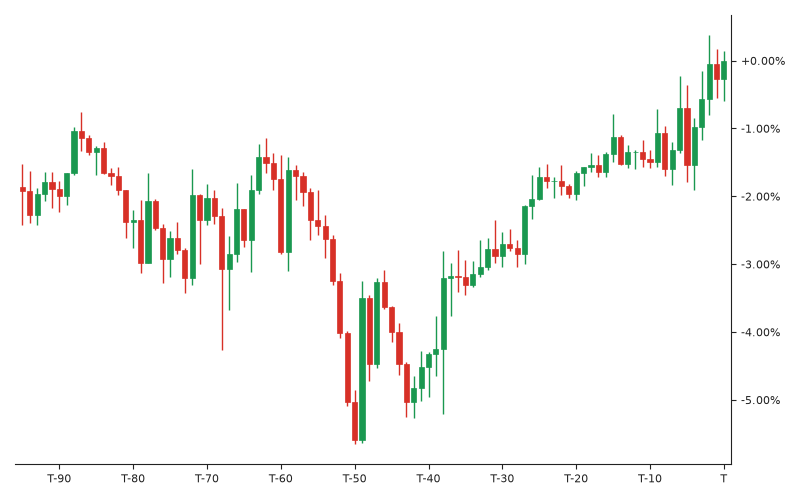

AI summary: Price sold off into a sharp V-shaped low around the middle-left, then reversed and climbed in a fairly steady sequence of higher highs and higher lows into the right edge. The far right shows price pressing near the top of the visible range after a brief pause just below the 0.00% area.
AI context: Before the current setup, price was in a strong recovery from the deep trough near T-50, with successive higher swings carrying it upward.
AI location: The right edge is testing the prior local high area near 0.00%, after already reclaiming the -1.00% and -2.00% zones and holding above the recent pullback lows.
AI development: A multi-leg advance rose from the T-50 low, paused briefly around the -1.5% to -1.0% area, then continued higher with clustered candles and a final push toward the top of the chart.
AI trigger: A completed candle closing above the most recent swing high / the 0.00% area at the right edge would make this breakout actionable.

| condition | ok | detail |
|---|---|---|
| H1 a decline preceded: DN > q33 | ok | DN 0.1860 vs q33 0.1845 |
| H2 rebound > q33 or compact edge | ok | REB 0.3775 vs q33 0.1886; ZR 0.4022 vs q33 0.3754 |
| H3 near the local high DT <= q33 | ok | DT 0.0618 vs q33 0.1307 |

### S0129 (2025-10-26T04:15:00+00:00) - present at T: False, present at T-1: False, fired on last two: False
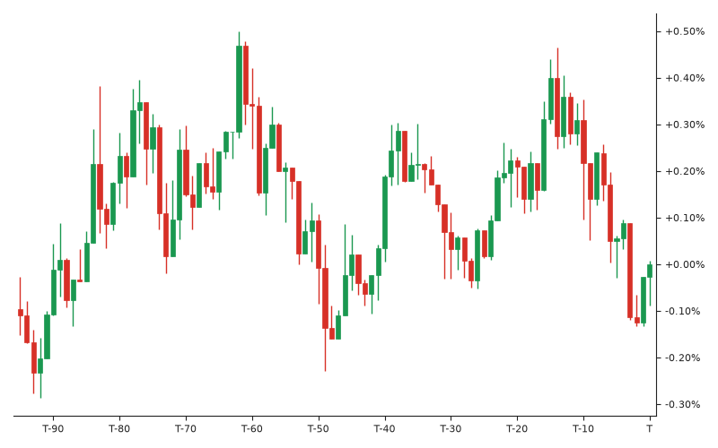

AI summary: Price first rallied from the left-side lows into a sharp peak near the middle, then swung down, up again, and finally rolled over from a right-side high into a selloff. At the far right edge it has bounced off a dip near flat and is testing back upward after a small two-candle recovery.
AI context: Before the right-edge setup, price was falling from a local high near the +0.30% to +0.40% area and then printed a quick flush down toward and slightly below 0.00%.
AI location: The interesting feature is the rebound from the recent right-edge low near -0.10% to -0.15% back toward the 0.00% line, with the last candle pushing up from that low area.
AI development: A decline from the right-side swing high led into a sharp two-candle drop, followed by a brief bounce and then another push lower into the recent trough. The last few candles show a rebound off that trough, with the latest candle moving back above the nearby lows.
AI trigger: A completed candle closing back above the local rebound area around 0.00% after the flush lower.

| condition | ok | detail |
|---|---|---|
| H1 a decline preceded: DN > q33 | ok | DN 0.1929 vs q33 0.1845 |
| H2 rebound > q33 or compact edge | ok | REB 0.4523 vs q33 0.1886; ZR 0.7633 vs q33 0.3754 |
| H3 near the local high DT <= q33 | NO | DT 0.5927 vs q33 0.1307 |

### S0157 (2025-12-16T10:30:00+00:00) - present at T: False, present at T-1: False, fired on last two: False
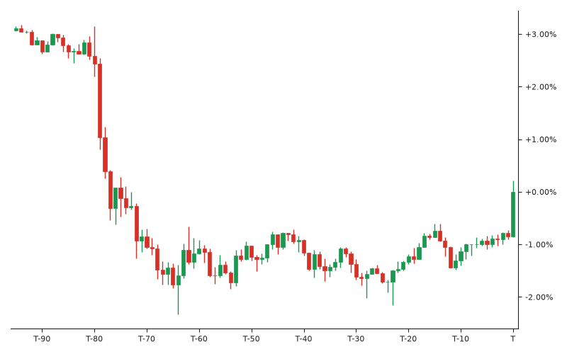

AI summary: Price fell sharply from the upper left in a steep selloff, then spent a long stretch moving sideways in a broad, choppy base below zero. At the far right edge, a strong green candle has pushed up sharply from the recent consolidation.
AI context: After the initial drop, price formed an extended sideways base with alternating small swings and repeated tests around the -1% to -2% area.
AI location: The right-edge green candle is a clear upside break away from the prior short-term range highs around the -1% area.
AI development: A steep decline was followed by a choppy range, then a series of small higher pushes near the right side, ending with a large green candle extending above the recent local highs.
AI trigger: A completed candle closes above the recent range high / prior swing high near the top of the latest consolidation, with the breakout candle’s body clearly above that level.

| condition | ok | detail |
|---|---|---|
| H1 a decline preceded: DN > q33 | NO | DN 0.1607 vs q33 0.1845 |
| H2 rebound > q33 or compact edge | ok | REB 0.3091 vs q33 0.1886; ZR 0.4306 vs q33 0.3754 |
| H3 near the local high DT <= q33 | ok | DT 0.0392 vs q33 0.1307 |

### S0282 (2025-12-18T18:30:00+00:00) - present at T: False, present at T-1: False, fired on last two: False
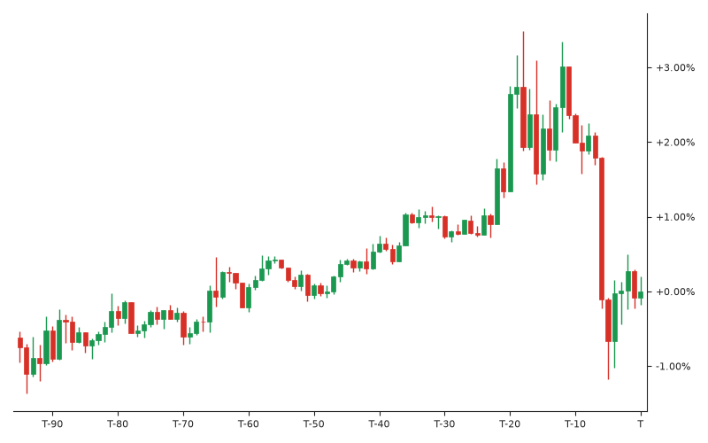

AI summary: Price trends upward in a stair-step fashion for most of the chart, then accelerates into a sharp push to the +3% area with tall volatile candles. At the right edge there is a steep red selloff followed by a partial bounce and tight chop near flat.
AI context: The chart had been climbing steadily with higher swings into a late-stage volatile top around +2% to +3%.
AI location: A large bearish impulse dropped price from the +2%/+3% area to below 0%, and the current candles are holding around the rebound zone near the zero line after that drop.
AI development: Uptrend into a spike high, then multiple choppy candles at elevated levels, then a sudden large red breakdown candle, followed by a smaller rebound and sideways candles near flat.
AI trigger: A completed candle that closes back above the immediate rebound high after the selloff, showing follow-through away from the breakdown low.

| condition | ok | detail |
|---|---|---|
| H1 a decline preceded: DN > q33 | ok | DN 0.9329 vs q33 0.1845 |
| H2 rebound > q33 or compact edge | ok | REB 0.3435 vs q33 0.1886; ZR 0.9603 vs q33 0.3754 |
| H3 near the local high DT <= q33 | NO | DT 0.7187 vs q33 0.1307 |

### S0284 (2026-03-30T00:15:00+00:00) - present at T: False, present at T-1: False, fired on last two: False
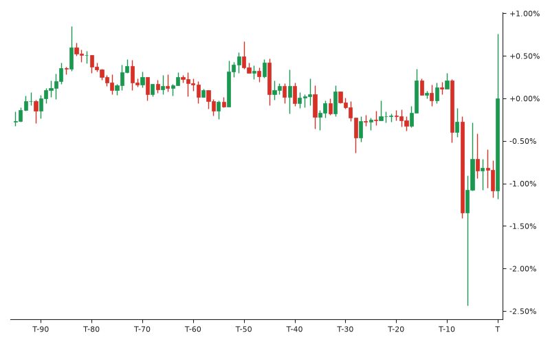

AI summary: Price chopped sideways to slightly lower for most of the chart, then sold off sharply near the right edge into a deep spike down. The last visible candle is a very large bullish candle that rebounds hard from that low back toward the prior range.
AI context: Before the right-edge move, price was ranging and drifting lower, then broke down aggressively into a fresh low.
AI location: The current candle has reclaimed a large portion of the selloff and is printing up into the area of the prior bounce range after a pronounced downside spike.
AI development: Sideways-to-down drift, then a sharp drop with a long lower wick, followed immediately by a strong upward reversal candle.
AI trigger: A completed candle that closes back above the immediate post-drop consolidation/range high after the sharp rebound.

| condition | ok | detail |
|---|---|---|
| H1 a decline preceded: DN > q33 | ok | DN 0.8325 vs q33 0.1845 |
| H2 rebound > q33 or compact edge | ok | REB 0.9740 vs q33 0.1886; ZR 0.9740 vs q33 0.3754 |
| H3 near the local high DT <= q33 | NO | DT 0.2318 vs q33 0.1307 |

### S0396 (2025-11-30T10:00:00+00:00) - present at T: False, present at T-1: False, fired on last two: False
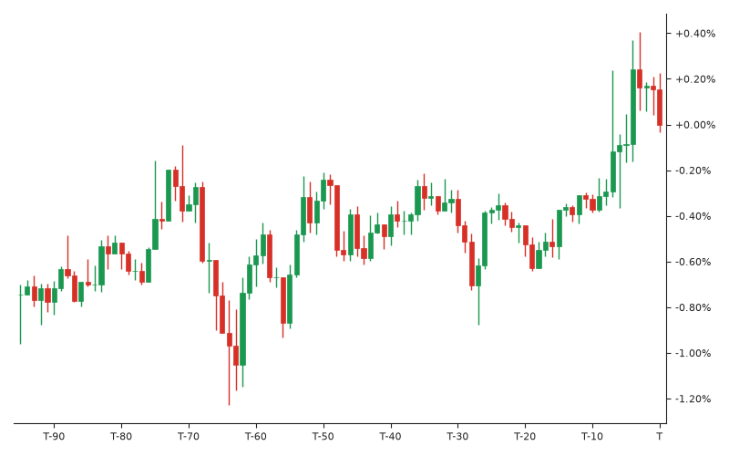

AI summary: Price spent most of the chart in a choppy sideways range after an earlier drop, then pushed sharply higher into the right edge. At the far right it has stalled just under the recent spike high and is pulling back from the top of the move.
AI context: Before the current move, price was range-bound and repeatedly oscillating around the mid/lower part of the chart after the prior selloff.
AI location: The interesting relationship is the breakout/rally into the upper-right area above the prior consolidation, with the last candles hesitating beneath the recent peak near the +0.40% region.
AI development: A sequence of higher candles drove price up from around the -0.40% to -0.20% area, broke above nearby prior highs, printed a sharp vertical advance, then showed a small pullback/consolidation at the top.
AI trigger: A completed candle that closes above the recent spike high near the +0.40% area, or a completed candle that breaks back below the immediate breakout base after the surge, would make the move actionable in a chosen direction.

| condition | ok | detail |
|---|---|---|
| H1 a decline preceded: DN > q33 | ok | DN 0.2082 vs q33 0.1845 |
| H2 rebound > q33 or compact edge | ok | REB 0.6413 vs q33 0.1886; ZR 0.6413 vs q33 0.3754 |
| H3 near the local high DT <= q33 | NO | DT 0.2476 vs q33 0.1307 |

### S0409 (2026-01-30T01:45:00+00:00) - present at T: False, present at T-1: False, fired on last two: False
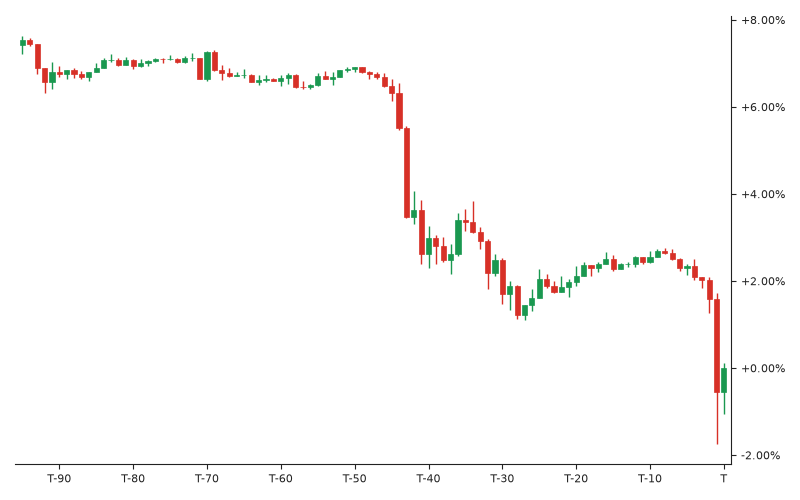

AI summary: Price spent the left half of the chart in a relatively tight sideways range near the top, then broke sharply lower around the middle and stayed volatile in a lower band. At the right edge it has sold off hard again into and below the 0% area after a small bounce.
AI context: After the large mid-chart drop, price formed a choppy lower consolidation and a mild rebound before rolling over again near the right edge.
AI location: The current move is pressing down through the lower-right swing area and has just made a fresh downside push after the rebound, with the last candles breaking below the prior short-term floor and approaching the chart low.
AI development: A bounce developed from the mid-plot low, then price drifted higher in a small rising cluster, then turned down with a sequence of red candles, and finally printed a strong bearish candle that undercut the recent range and the 0% line.
AI trigger: A completed candle that closes below the recent lower swing low / short-term support from the right-edge consolidation after the bounce.

| condition | ok | detail |
|---|---|---|
| H1 a decline preceded: DN > q33 | NO | DN 0.0673 vs q33 0.1845 |
| H2 rebound > q33 or compact edge | NO | REB 0.1184 vs q33 0.1886; ZR 0.4791 vs q33 0.3754 |
| H3 near the local high DT <= q33 | NO | DT 0.2933 vs q33 0.1307 |

### S0444 (2026-02-15T06:30:00+00:00) - present at T: True, present at T-1: True, fired on last two: False
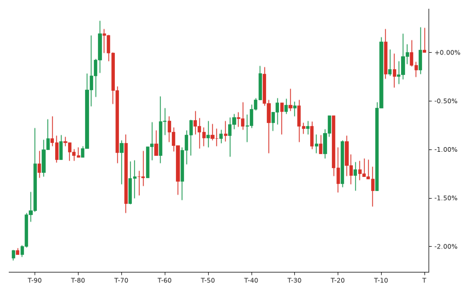

AI summary: Price surged sharply upward from a lower-left base into the right edge, then stalled and chopped just under the 0.00% line. The last few candles show a tight consolidation near the highs after the impulse move.
AI context: Before the current right-edge pause, price was declining and then printed a strong bullish impulse up from around the -1.5% area toward flat.
AI location: The current candles are consolidating directly below the prior swing high / near the 0.00% reference after a near-vertical advance.
AI development: A sharp green breakout leg lifted price from the -1.4% to -1.5% region, followed by several small alternating candles clustering near the top of that move and around the 0.00% level.
AI trigger: A completed candle closing above the recent consolidation high / the top of the right-edge range after this pause.

| condition | ok | detail |
|---|---|---|
| H1 a decline preceded: DN > q33 | ok | DN 0.3803 vs q33 0.1845 |
| H2 rebound > q33 or compact edge | ok | REB 0.7508 vs q33 0.1886; ZR 0.7508 vs q33 0.3754 |
| H3 near the local high DT <= q33 | ok | DT 0.1071 vs q33 0.1307 |

### S0550 (2026-05-31T01:00:00+00:00) - present at T: True, present at T-1: True, fired on last two: True
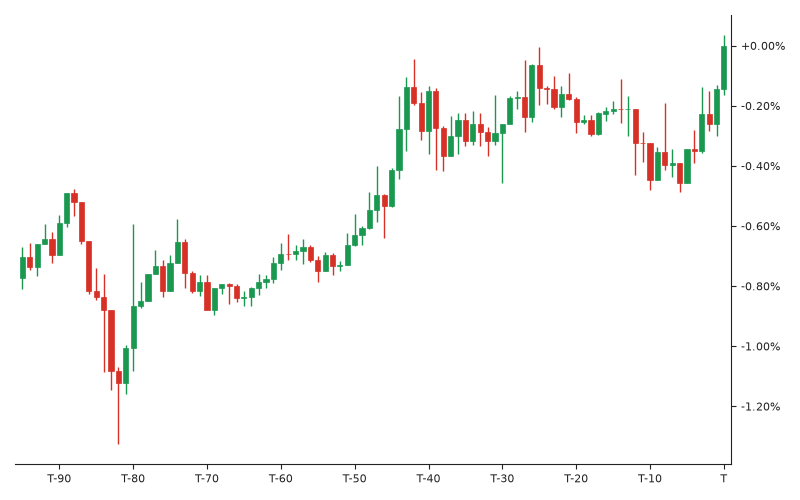

AI summary: Price sold off sharply on the left, then recovered in a broad climb with choppy pauses. At the right edge it has pushed back up to the top of the recent range near the zero line after a rebound from the -0.4% area.
AI context: After the strong rise from the mid-chart low, price spent time consolidating in a sideways, choppy band below the highs before the latest push upward.
AI location: The current candles are pressing into the prior local high / top boundary of the recent consolidation, with the last candle reaching the highest visible area on the chart near 0.00%.
AI development: A rebound developed from the recent dip around -0.4%, then successive higher candles carried price through the prior intrarange levels and up to the top of the range.
AI trigger: A completed candle that closes above the prior visible swing high / the top of the recent range near 0.00%.

| condition | ok | detail |
|---|---|---|
| H1 a decline preceded: DN > q33 | ok | DN 0.2200 vs q33 0.1845 |
| H2 rebound > q33 or compact edge | ok | REB 0.3843 vs q33 0.1886; ZR 0.3843 vs q33 0.3754 |
| H3 near the local high DT <= q33 | ok | DT 0.0250 vs q33 0.1307 |

## S8 bearish_breakdown_from_right_edge_support: 5 cited charts, recognized (present at T or fired on the last two candles): 1

Charts failing each condition: {"I3 recent swing low, above it, near it, pressing lower": 5, "I4 rolling over from a recent high": 1, "I1 prior rise or bounce": 1}
Charts missing by exactly one condition: {"I3 recent swing low, above it, near it, pressing lower": 3}

### S0011 (2025-12-26T07:45:00+00:00) - present at T: False, present at T-1: False, fired on last two: False
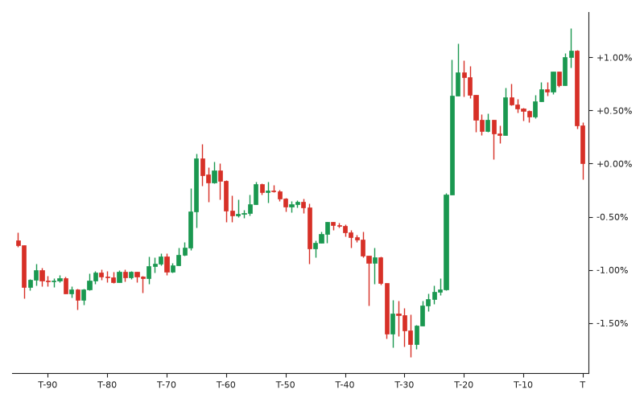

AI summary: Price spent most of the chart in a broad decline, then reversed sharply with a strong vertical rally near T-20. After that spike it chopped near the highs, printed a new local high close to the right edge, and then sold off sharply on the last few candles.
AI context: The chart showed a large rebound off the T-30 area after an extended downswing, followed by a short consolidation near the top of the move.
AI location: The right edge is now at a failed push to highs: the last candles drop back through the upper part of the recent range after making a local high near +1.0%.
AI development: Strong rally from the T-20 area, pullback and sideways consolidation, recovery back toward the highs, then a bearish reversal candle followed by another down candle.
AI trigger: A completed candle has broken back down from the recent high area and closed materially lower, showing rejection after the push to the top of the range.

| condition | ok | detail |
|---|---|---|
| I1 prior rise or bounce | ok | UP 0.2306, REB 0.2845 vs q33 0.1889/0.1886 |
| I2 lower-high sequence, choppy edge or rebound | ok | lower_high=True, EFF 0.0663 vs q33 0.1079, REB 0.2845 |
| I3 recent swing low, above it, near it, pressing lower | NO | swing low idx 86, DF -0.1270 vs q33 0.1072, close 88433.00 vs 3 ago 89317.90 |
| I4 rolling over from a recent high | ok | swing high idx 83, high 89100.0 |

### S0112 (2025-10-19T10:15:00+00:00) - present at T: False, present at T-1: False, fired on last two: False
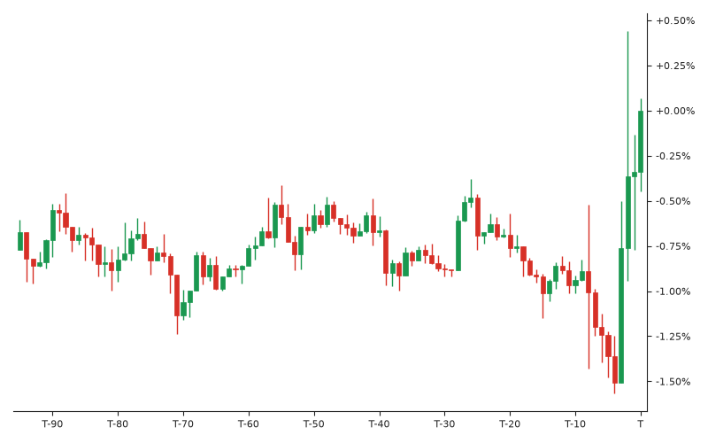

AI summary: Price spent most of the chart drifting and chopping lower in a broad range, then sold off sharply into the right edge. At the end there is a very strong vertical rebound that retraces most of the drop and reaches back to around flat/near the prior swing area.
AI context: Before the right-edge move, price had been declining in waves and then accelerated lower into a late selloff near the bottom of the visible range.
AI location: The current move is pressing up into the prior breakdown area and recent intrabar highs after a steep downswing, with the latest candles showing a sharp reversal off the low and a push through nearby resistance levels on the right edge.
AI development: A lower-low selloff extended into the low-1.5% area, then a large bullish candle reversed sharply upward, followed by additional strong green candles that continued the rebound and tested the upper end of the rebound range.
AI trigger: A completed bullish candle that closes above the immediate rebound highs / prior small-bar resistance near the right edge, confirming the recovery from the low.

| condition | ok | detail |
|---|---|---|
| I1 prior rise or bounce | ok | UP 0.3134, REB 1.0000 vs q33 0.1889/0.1886 |
| I2 lower-high sequence, choppy edge or rebound | ok | lower_high=False, EFF 0.2191 vs q33 0.1079, REB 1.0000 |
| I3 recent swing low, above it, near it, pressing lower | NO | swing low idx 91, DF 0.7812 vs q33 0.1072, close 107742.40 vs 3 ago 106923.60 |
| I4 rolling over from a recent high | NO | swing high idx 87, high 107180.0 |

### S0364 (2026-02-09T11:00:00+00:00) - present at T: False, present at T-1: False, fired on last two: False
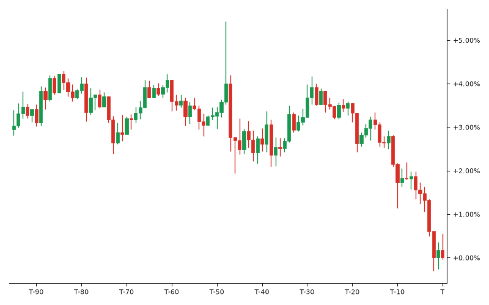

AI summary: Price spent the left and middle of the chart churning in a broad range around the 3%–4% area, then rolled over into a steady selloff. At the right edge it has broken down sharply and is now clustered near the 0% line after a series of lower candles.
AI context: Before the current setup, price was ranging and then failed around the mid-chart swing highs, followed by a lower-high sequence and a sustained move downward.
AI location: The current price is pressing at the lower boundary of the visible move, around the 0% area, after breaking below prior support levels from the late range and the last minor consolidation.
AI development: A rally attempt near the -1% to 0% area was rejected, then successive candles made lower highs and lower lows, culminating in a steep drop into the current trough area.
AI trigger: A completed candle closing below the most recent low/support in the selloff, with the breakdown already visible on the last finished candle.

| condition | ok | detail |
|---|---|---|
| I1 prior rise or bounce | NO | UP 0.1572, REB 0.1842 vs q33 0.1889/0.1886 |
| I2 lower-high sequence, choppy edge or rebound | ok | lower_high=True, EFF 0.6100 vs q33 0.1079, REB 0.1842 |
| I3 recent swing low, above it, near it, pressing lower | NO | swing low idx 85, DF -0.1986 vs q33 0.1072, close 68578.80 vs 3 ago 69000.00 |
| I4 rolling over from a recent high | ok | swing high idx 80, high 70868.1 |

### S0419 (2025-12-21T02:15:00+00:00) - present at T: False, present at T-1: False, fired on last two: False
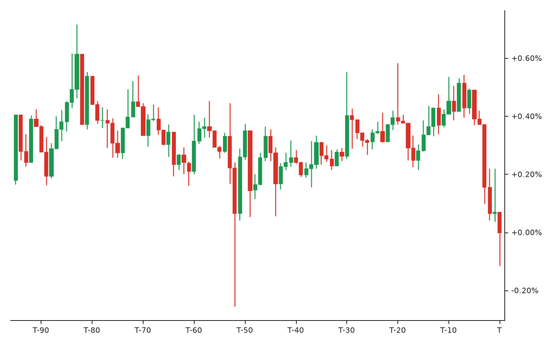

AI summary: Price was choppy and range-like for most of the chart, with swings around the +0.20% to +0.50% area, then a sharp selloff developed at the far right edge. The last candles show a fast drop from the upper range toward and slightly below 0.00%.
AI context: Before the right-edge move, price had been oscillating in a sideways-to-slightly-rising range after the mid-chart low spike, repeatedly stalling near the +0.40% to +0.50% area.
AI location: The current move is interesting because it has broken down from the recent local range and the last completed candles are pressing through the 0.00% area after a steep vertical decline.
AI development: A small topping area formed near the recent highs around +0.45% to +0.50%, then several red candles pushed lower in succession, accelerating into a sharp drop at the right edge.
AI trigger: A completed candle that closes decisively below the recent local floor around 0.00% after the sharp breakdown makes it actionable.

| condition | ok | detail |
|---|---|---|
| I1 prior rise or bounce | ok | UP 0.3386, REB 0.3386 vs q33 0.1889/0.1886 |
| I2 lower-high sequence, choppy edge or rebound | ok | lower_high=True, EFF 0.2334 vs q33 0.1079, REB 0.3386 |
| I3 recent swing low, above it, near it, pressing lower | NO | swing low idx 79, DF -0.2209 vs q33 0.1072, close 87922.60 vs 3 ago 88059.80 |
| I4 rolling over from a recent high | ok | swing high idx 88, high 88400.0 |

### S0449 (2026-04-19T22:00:00+00:00) - present at T: False, present at T-1: True, fired on last two: True
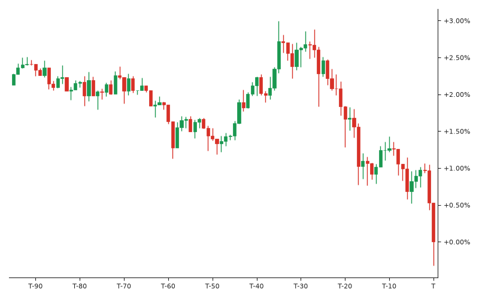

AI summary: Price drifted lower from the left, then rallied into a peak around the mid-right before rolling over into a sharp selloff. At the right edge, a large bearish candle has extended the decline to near the zero line with a lower wick below it.
AI context: After the mid-chart rise to the +2.5% to +3.0% area, price formed a topping area and then broke down in a series of lower candles.
AI location: The current move is pressing through the prior short-term swing lows and is now sitting at the lowest area visible on the chart, with the latest candle making a fresh push down near the chart low.
AI development: Rally into a rounded top near +2.8%, then a sequence of lower highs and lower lows, followed by an accelerated drop through the prior consolidation and the prior low cluster.
AI trigger: A completed bearish candle that closes near the low of the session and below the preceding short-term low cluster at the right edge.

| condition | ok | detail |
|---|---|---|
| I1 prior rise or bounce | ok | UP 0.2013, REB 0.1638 vs q33 0.1889/0.1886 |
| I2 lower-high sequence, choppy edge or rebound | ok | lower_high=True, EFF 0.5901 vs q33 0.1079, REB 0.1638 |
| I3 recent swing low, above it, near it, pressing lower | NO | swing low idx 90, DF -0.1587 vs q33 0.1072, close 73986.10 vs 3 ago 74707.50 |
| I4 rolling over from a recent high | ok | swing high idx 85, high 75043.1 |

## S9 tight_range_breakout_both_directions: 2 cited charts, recognized (present at T or fired on the last two candles): 0

Charts failing each condition: {"compact range ZR <= q33": 2}
Charts missing by exactly one condition: {"compact range ZR <= q33": 2}

### S0168 (2025-10-16T19:15:00+00:00) - present at T: False, present at T-1: False, fired on last two: False
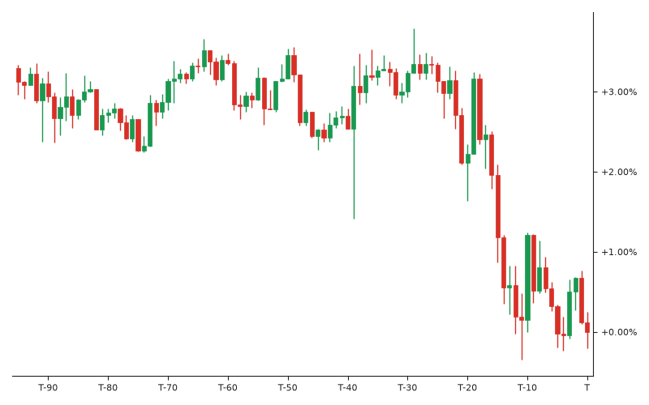

AI summary: Price spent most of the chart ranging and swinging around the +2% to +3% area, then broke sharply lower on a sequence of large red candles. At the right edge it is rebounding from a deep drop, but the rebound is still choppy and sits near the zero line.
AI context: The chart was range-bound to slightly elevated for a long stretch, then formed a clear downside break from the upper area into a steep selloff.
AI location: The interesting feature is the sharp breakdown from the prior consolidation/range and the current reaction near the low area around the 0% line after the vertical drop.
AI development: After several candles holding near the top range, price rolled over, broke down through the midrange, then accelerated lower in a series of strong red candles. The last few candles show a small bounce and renewed hesitation near the lows.
AI trigger: A completed candle that closes back above the immediate rebound high after the drop, or alternatively a completed candle that closes below the current local low after the bounce, would make the next move clearer and actionable.

| condition | ok | detail |
|---|---|---|
| compact range ZR <= q33 | NO | ZR 0.8862 vs q33 0.3754 |
| a prior move exists | ok | UP 0.3835, DN 0.3562 |
| close inside the range | ok | close 107875.90 in [107503.30, 111452.70] |

### S0480 (2026-04-26T21:45:00+00:00) - present at T: False, present at T-1: False, fired on last two: False
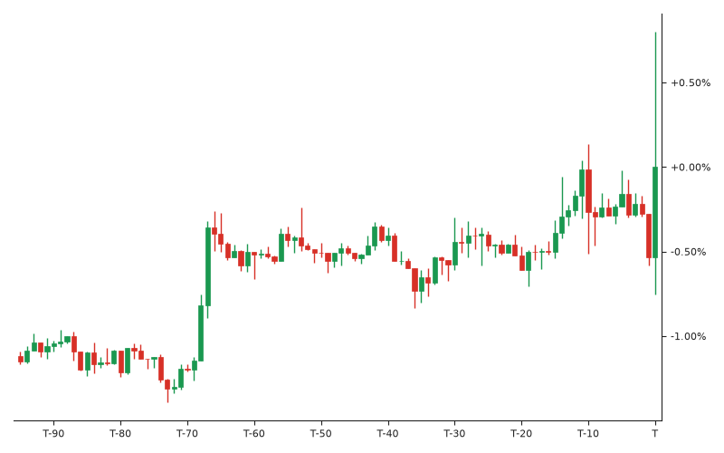

AI summary: Price drifted lower on the left, then made a sharp upward jump and spent time chopping sideways in a broad range. Near the right edge it pushed up again, then sold off sharply into the last candle, which has a very large wick and closes back near the prior swing area.
AI context: After the mid-chart jump, price moved in a choppy sideways consolidation with repeated tests of roughly the same upper and lower bounds.
AI location: The right edge is sitting at the top of a sharp rejection candle after a fast drop from the recent local highs, right around the same area that has acted as a short-term pivot during the consolidation.
AI development: Sideways range after the impulse up, then a push toward the upper part of the range, then a sharp rejection down into the lower part of the range on the last completed candle.
AI trigger: A completed candle that breaks and holds above the recent local highs near the top of the range would make an upside breakout setup actionable; alternatively, a completed candle that breaks below the recent range low would make a downside breakdown actionable.

| condition | ok | detail |
|---|---|---|
| compact range ZR <= q33 | NO | ZR 0.7102 vs q33 0.3754 |
| a prior move exists | ok | UP 0.2258, DN 0.0512 |
| close inside the range | ok | close 78369.70 in [77777.00, 78994.80] |

