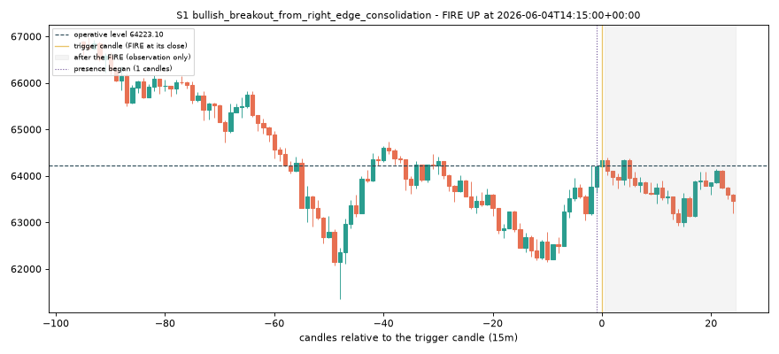
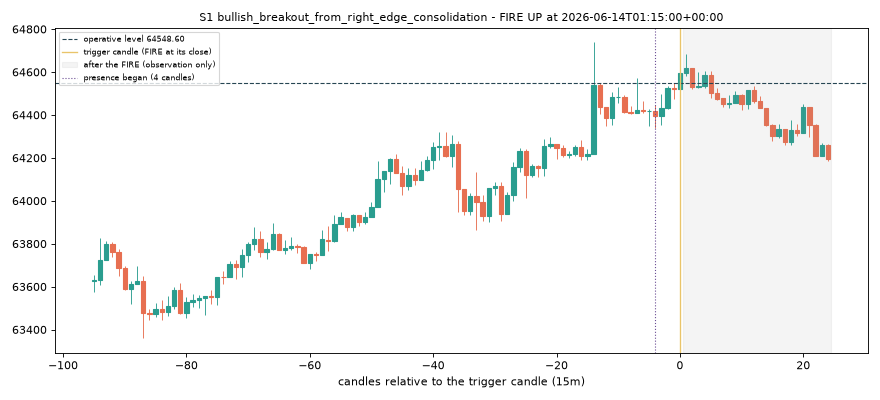
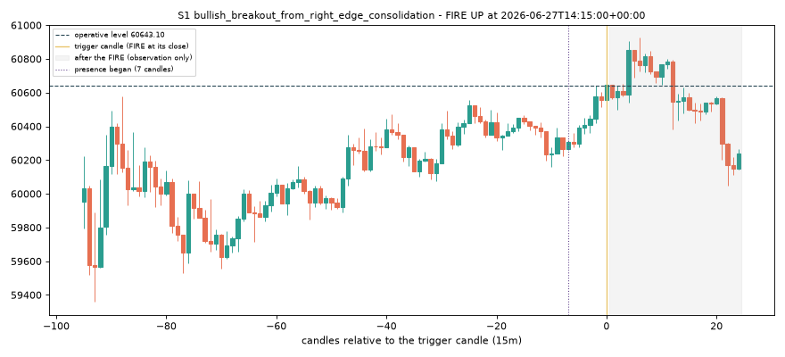
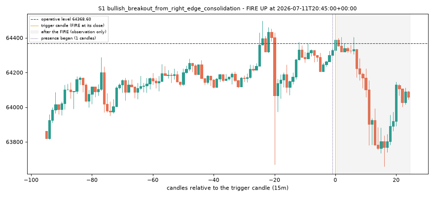
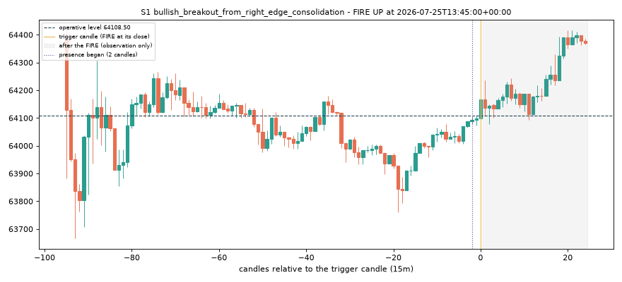
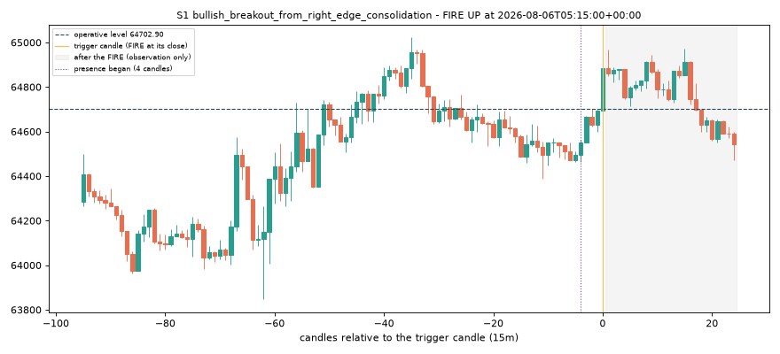
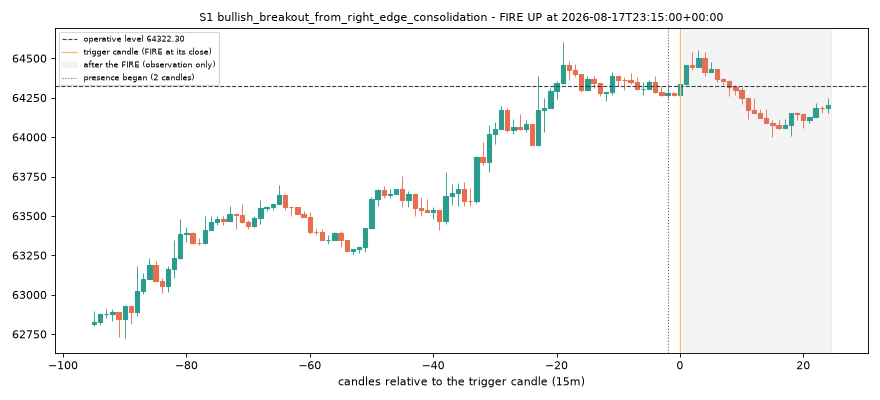
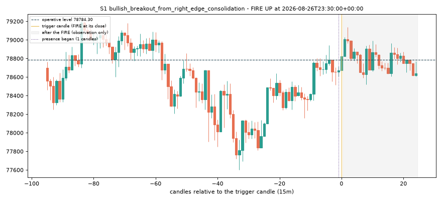
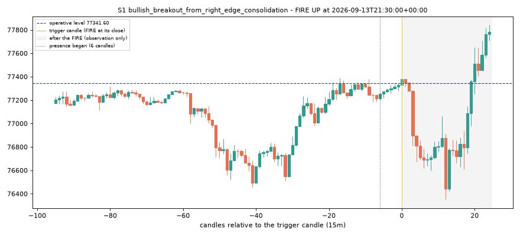
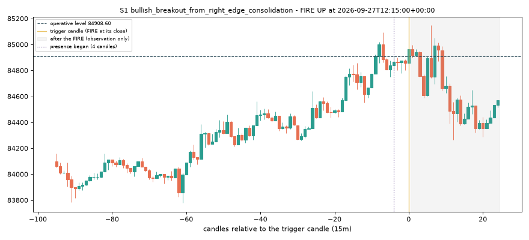

# S1 v2 scan report (S1 only; S2-S9 are the v1 functions)

Descriptive. Bad recognitions are to be listed by the reviewer, not patched. No fill, no trade.

## v1 vs v2

S2-S9 fires identical to v1: **True**

| setup | v1 fires | v2 fires | identical |
|---|---:|---:|---|
| S1 | 305 | 1205 | False |
| S2 | 636 | 636 | True |
| S3 | 191 | 191 | True |
| S4 | 101 | 101 | True |
| S5 | 55 | 55 | True |
| S6 | 284 | 284 | True |
| S7 | 703 | 703 | True |
| S8 | 668 | 668 | True |
| S9 | 574 | 574 | True |

S1: v1 305 fires, v2 1205; same candle 144; v1 only 161; v2 only 1061; Jaccard 0.105.
By period: v1 {'IN_SAMPLE': 213, 'UNSEEN': 92}, v2 {'IN_SAMPLE': 833, 'UNSEEN': 372}.

## The 12 cited charts, v2 at T .. T-6 (a consistency check, not a recall target)

| chart | end | fired in T..T-6 | present in T..T-6 | per candle (k: P=present F=fired .=neither; failing condition) |
|---|---|---|---|---|
| S0013 | 2025-11-23T01:30:00+00:00 | True | True | 0:PF 1:PF 2:P 3:. 4:. 5:. 6:P; at T: None |
| S0036 | 2026-05-26T14:00:00+00:00 | False | False | 0:. 1:. 2:. 3:. 4:. 5:. 6:.; at T: A2 compact edge ZR <= q33 OR shallow pullback RET <= q33 |
| S0120 | 2026-05-01T05:30:00+00:00 | False | False | 0:. 1:. 2:. 3:. 4:. 5:. 6:.; at T: A2 compact edge ZR <= q33 OR shallow pullback RET <= q33 |
| S0159 | 2025-12-31T01:30:00+00:00 | True | True | 0:PF 1:P 2:. 3:. 4:. 5:. 6:.; at T: None |
| S0163 | 2026-01-09T15:30:00+00:00 | False | False | 0:. 1:. 2:. 3:. 4:. 5:. 6:.; at T: A2 compact edge ZR <= q33 OR shallow pullback RET <= q33 |
| S0176 | 2025-11-02T23:00:00+00:00 | False | False | 0:. 1:. 2:. 3:. 4:. 5:. 6:.; at T: A1 recent swing high and net up-leg > q33(UPnet) |
| S0181 | 2025-09-28T15:30:00+00:00 | False | False | 0:. 1:. 2:. 3:. 4:. 5:. 6:.; at T: A1 recent swing high and net up-leg > q33(UPnet) |
| S0201 | 2026-04-29T10:15:00+00:00 | True | True | 0:. 1:. 2:.F 3:P 4:. 5:. 6:.; at T: A2 compact edge ZR <= q33 OR shallow pullback RET <= q33 |
| S0347 | 2025-10-23T04:30:00+00:00 | True | True | 0:PF 1:P 2:. 3:. 4:. 5:PF 6:PF; at T: None |
| S0472 | 2026-02-13T15:15:00+00:00 | False | True | 0:. 1:. 2:. 3:. 4:P 5:. 6:.; at T: A2 compact edge ZR <= q33 OR shallow pullback RET <= q33 |
| S0500 | 2026-05-04T03:15:00+00:00 | False | False | 0:. 1:. 2:. 3:. 4:. 5:. 6:.; at T: A2 compact edge ZR <= q33 OR shallow pullback RET <= q33 |
| S0535 | 2026-05-10T16:30:00+00:00 | False | False | 0:. 1:. 2:. 3:. 4:. 5:. 6:.; at T: A2 compact edge ZR <= q33 OR shallow pullback RET <= q33 |

## Ten unseen-period v2 fires for inspection (evenly spaced, deterministic; first fire of each run)

### 1. S1-26552-up 2026-06-04T14:15:00+00:00 (also a v1 fire: False)

S1 (bullish_breakout_from_right_edge_consolidation) was PRESENT for 1 completed candle(s) up to the previous candle; the trigger candle closed at 64331.60, above the operative level 64223.10, so the brain fired UP on that close. Invalidation rules at the fire: close lt 62150.80, close le 64223.10.

| previous-candle condition | ok | detail |
|---|---|---|
| A1 recent swing high and net up-leg > q33(UPnet) | ok | swing high idx 65 (recent from 48), UPnet 0.5569 vs q33 0.4635 |
| A2 compact edge ZR <= q33 OR shallow pullback RET <= q33 | ok | ZR 0.3681 vs q33 0.3754; RET 2.6693 vs q33 0.6908 |
| A3 close near the pause high DT <= q33 | ok | DT 0.0036 vs q33 0.0705 (pause high 64223.10, close 64202.70) |

### 2. S1-27460-up 2026-06-14T01:15:00+00:00 (also a v1 fire: False)

S1 (bullish_breakout_from_right_edge_consolidation) was PRESENT for 4 completed candle(s) up to the previous candle; the trigger candle closed at 64596.40, above the operative level 64548.60, so the brain fired UP on that close. Invalidation rules at the fire: close lt 64338.80, close le 64548.60.

| previous-candle condition | ok | detail |
|---|---|---|
| A1 recent swing high and net up-leg > q33(UPnet) | ok | swing high idx 89 (recent from 48), UPnet 0.8795 vs q33 0.4635 |
| A2 compact edge ZR <= q33 OR shallow pullback RET <= q33 | ok | ZR 0.4549 vs q33 0.3754; RET 0.6098 vs q33 0.6908 |
| A3 close near the pause high DT <= q33 | ok | DT 0.0213 vs q33 0.0705 (pause high 64548.60, close 64519.30) |

### 3. S1-28760-up 2026-06-27T14:15:00+00:00 (also a v1 fire: False)

S1 (bullish_breakout_from_right_edge_consolidation) was PRESENT for 7 completed candle(s) up to the previous candle; the trigger candle closed at 60645.70, above the operative level 60643.10, so the brain fired UP on that close. Invalidation rules at the fire: close lt 60162.00, close le 60643.10.

| previous-candle condition | ok | detail |
|---|---|---|
| A1 recent swing high and net up-leg > q33(UPnet) | ok | swing high idx 81 (recent from 48), UPnet 0.8625 vs q33 0.4635 |
| A2 compact edge ZR <= q33 OR shallow pullback RET <= q33 | ok | ZR 0.3746 vs q33 0.3754; RET 1.4818 vs q33 0.6908 |
| A3 close near the pause high DT <= q33 | ok | DT 0.0689 vs q33 0.0705 (pause high 60643.10, close 60554.60) |

### 4. S1-30130-up 2026-07-11T20:45:00+00:00 (also a v1 fire: False)

S1 (bullish_breakout_from_right_edge_consolidation) was PRESENT for 1 completed candle(s) up to the previous candle; the trigger candle closed at 64388.70, above the operative level 64368.60, so the brain fired UP on that close. Invalidation rules at the fire: close lt 64205.70, close le 64368.60.

| previous-candle condition | ok | detail |
|---|---|---|
| A1 recent swing high and net up-leg > q33(UPnet) | ok | swing high idx 84 (recent from 48), UPnet 0.8532 vs q33 0.4635 |
| A2 compact edge ZR <= q33 OR shallow pullback RET <= q33 | ok | ZR 1.0000 vs q33 0.3754; RET 0.2406 vs q33 0.6908 |
| A3 close near the pause high DT <= q33 | ok | DT 0.0482 vs q33 0.0705 (pause high 64368.60, close 64328.70) |

### 5. S1-31446-up 2026-07-25T13:45:00+00:00 (also a v1 fire: False)

S1 (bullish_breakout_from_right_edge_consolidation) was PRESENT for 2 completed candle(s) up to the previous candle; the trigger candle closed at 64167.00, above the operative level 64108.50, so the brain fired UP on that close. Invalidation rules at the fire: close lt 64006.20, close le 64108.50.

| previous-candle condition | ok | detail |
|---|---|---|
| A1 recent swing high and net up-leg > q33(UPnet) | ok | swing high idx 88 (recent from 48), UPnet 0.5490 vs q33 0.4635 |
| A2 compact edge ZR <= q33 OR shallow pullback RET <= q33 | ok | ZR 0.4631 vs q33 0.3754; RET 0.2274 vs q33 0.6908 |
| A3 close near the pause high DT <= q33 | ok | DT 0.0125 vs q33 0.0705 (pause high 64108.50, close 64099.10) |

### 6. S1-32564-up 2026-08-06T05:15:00+00:00 (also a v1 fire: False)

S1 (bullish_breakout_from_right_edge_consolidation) was PRESENT for 4 completed candle(s) up to the previous candle; the trigger candle closed at 64885.20, above the operative level 64702.90, so the brain fired UP on that close. Invalidation rules at the fire: close lt 64386.30, close le 64702.90.

| previous-candle condition | ok | detail |
|---|---|---|
| A1 recent swing high and net up-leg > q33(UPnet) | ok | swing high idx 83 (recent from 48), UPnet 0.6706 vs q33 0.4635 |
| A2 compact edge ZR <= q33 OR shallow pullback RET <= q33 | ok | ZR 0.2850 vs q33 0.3754; RET 2.4614 vs q33 0.6908 |
| A3 close near the pause high DT <= q33 | ok | DT 0.0060 vs q33 0.0705 (pause high 64702.90, close 64695.90) |

### 7. S1-33692-up 2026-08-17T23:15:00+00:00 (also a v1 fire: False)

S1 (bullish_breakout_from_right_edge_consolidation) was PRESENT for 2 completed candle(s) up to the previous candle; the trigger candle closed at 64334.90, above the operative level 64322.30, so the brain fired UP on that close. Invalidation rules at the fire: close lt 64247.80, close le 64322.30.

| previous-candle condition | ok | detail |
|---|---|---|
| A1 recent swing high and net up-leg > q33(UPnet) | ok | swing high idx 92 (recent from 48), UPnet 0.8877 vs q33 0.4635 |
| A2 compact edge ZR <= q33 OR shallow pullback RET <= q33 | ok | ZR 0.3498 vs q33 0.3754; RET 0.8960 vs q33 0.6908 |
| A3 close near the pause high DT <= q33 | ok | DT 0.0291 vs q33 0.0705 (pause high 64322.30, close 64267.70) |

### 8. S1-34557-up 2026-08-26T23:30:00+00:00 (also a v1 fire: False)

S1 (bullish_breakout_from_right_edge_consolidation) was PRESENT for 1 completed candle(s) up to the previous candle; the trigger candle closed at 78821.90, above the operative level 78784.30, so the brain fired UP on that close. Invalidation rules at the fire: close lt 78513.70, close le 78784.30.

| previous-candle condition | ok | detail |
|---|---|---|
| A1 recent swing high and net up-leg > q33(UPnet) | ok | swing high idx 92 (recent from 48), UPnet 0.8406 vs q33 0.4635 |
| A2 compact edge ZR <= q33 OR shallow pullback RET <= q33 | ok | ZR 0.5273 vs q33 0.3754; RET 0.5470 vs q33 0.6908 |
| A3 close near the pause high DT <= q33 | ok | DT 0.0701 vs q33 0.0705 (pause high 78784.30, close 78672.10) |

### 9. S1-36277-up 2026-09-13T21:30:00+00:00 (also a v1 fire: False)

S1 (bullish_breakout_from_right_edge_consolidation) was PRESENT for 6 completed candle(s) up to the previous candle; the trigger candle closed at 77378.70, above the operative level 77341.60, so the brain fired UP on that close. Invalidation rules at the fire: close lt 77186.30, close le 77341.60.

| previous-candle condition | ok | detail |
|---|---|---|
| A1 recent swing high and net up-leg > q33(UPnet) | ok | swing high idx 87 (recent from 48), UPnet 0.9941 vs q33 0.4635 |
| A2 compact edge ZR <= q33 OR shallow pullback RET <= q33 | ok | ZR 0.4375 vs q33 0.3754; RET 0.4874 vs q33 0.6908 |
| A3 close near the pause high DT <= q33 | ok | DT 0.0157 vs q33 0.0705 (pause high 77341.60, close 77327.00) |

### 10. S1-37584-up 2026-09-27T12:15:00+00:00 (also a v1 fire: False)

S1 (bullish_breakout_from_right_edge_consolidation) was PRESENT for 4 completed candle(s) up to the previous candle; the trigger candle closed at 84963.10, above the operative level 84908.60, so the brain fired UP on that close. Invalidation rules at the fire: close lt 84750.10, close le 84908.60.

| previous-candle condition | ok | detail |
|---|---|---|
| A1 recent swing high and net up-leg > q33(UPnet) | ok | swing high idx 89 (recent from 48), UPnet 1.0000 vs q33 0.4635 |
| A2 compact edge ZR <= q33 OR shallow pullback RET <= q33 | ok | ZR 0.4998 vs q33 0.3754; RET 0.6328 vs q33 0.6908 |
| A3 close near the pause high DT <= q33 | ok | DT 0.0388 vs q33 0.0705 (pause high 84908.60, close 84857.50) |

